# Bina Yönetim Sistemi
## Kullanım Kılavuzu

---

**Versiyon:** 1.0  
**Tarih:** 2025  
**Hazırlayan:** Bina Yönetim Sistemi Ekibi

---

## 📋 İçindekiler

1. [Giriş ve Genel Bakış](#1-giriş-ve-genel-bakış)
2. [Sisteme Giriş](#2-sisteme-giriş)
3. [Ana Sayfa ve Navigasyon](#3-ana-sayfa-ve-navigasyon)
4. [Sistem Yönetimi](#4-sistem-yönetimi)
   - 4.1. [Kullanıcı Yönetimi](#41-kullanıcı-yönetimi)
   - 4.2. [Rol Yönetimi](#42-rol-yönetimi)
   - 4.3. [Rol Grupları](#43-rol-grupları)
   - 4.4. [Mesajlaşma](#44-mesajlaşma)
5. [Bina Yönetimi Temel Kurulum](#5-bina-yönetimi-temel-kurulum)
   - 5.1. [Bina Grupları Oluşturma](#51-bina-grupları-oluşturma)
   - 5.2. [Bina/Blok Kayıtları](#52-bina-blok-kayıtları)
   - 5.3. [Daire Kayıtları](#53-daire-kayıtları)
   - 5.4. [Kullanıcı-Daire Eşleştirmesi](#54-kullanıcı-daire-eşleştirmesi)
6. [Personel Yönetimi](#6-personel-yönetimi)
7. [Aidat Yönetimi](#7-aidat-yönetimi)
8. [Duyurular](#8-duyurular)
9. [Harcama Yönetimi](#9-harcama-yönetimi)
10. [Toplantı Yönetimi](#10-toplantı-yönetimi)
11. [Karar Yönetimi](#11-karar-yönetimi)
12. [Şikayet Yönetimi](#12-şikayet-yönetimi)
13. [Bakım ve Tadilat](#13-bakım-ve-tadilat)
14. [Ziyaretçi Yönetimi](#14-ziyaretçi-yönetimi)
15. [Araç Yönetimi](#15-araç-yönetimi)
16. [Otopark Yönetimi](#16-otopark-yönetimi)
17. [Stok ve Envanter Yönetimi](#17-stok-ve-envanter-yönetimi)
18. [Profil ve Ayarlar](#18-profil-ve-ayarlar)
19. [Sık Sorulan Sorular](#19-sık-sorulan-sorular)
20. [İletişim ve Destek](#20-iletişim-ve-destek)

---

## 1. Giriş ve Genel Bakış

### 1.1. Sistem Hakkında

Bina Yönetim Sistemi, site ve apartman yönetiminin tüm süreçlerini dijitalleştiren, merkezi bir kontrol ve yönetim platformudur. Sistem, yöneticilerin günlük operasyonlarını kolaylaştırırken, bina sakinlerine şeffaf ve hızlı bilgi erişimi sağlar.

### 1.2. Sistemin Temel Özellikleri

- **Merkezi Yönetim:** Tüm bina yönetim süreçleri tek platformda
- **Şeffaflık:** Tüm işlemlerin kayıt altına alınması ve görüntülenebilmesi
- **Erişilebilirlik:** Web ve mobil uygulama desteği ile her yerden erişim
- **Güvenlik:** Rol tabanlı erişim kontrolü ile güvenli veri yönetimi
- **Otomasyon:** Tekrarlayan işlemlerin otomatikleştirilmesi
- **Raporlama:** Detaylı raporlama ve analiz imkanları

### 1.3. Sistemin Kullanım Senaryoları

- Aidat takibi ve ödeme yönetimi
- Gider kayıtları ve mali raporlama
- Personel maaş ödemeleri
- Toplantı tutanakları ve karar kayıtları
- Duyuru yönetimi
- Şikayet ve talep takibi
- Bakım ve tadilat işlemleri
- Ziyaretçi ve araç yönetimi
- Stok ve envanter takibi

---

## 2. Sisteme Giriş

### 2.1. İlk Giriş

Sisteme giriş yapmak için aşağıdaki adımları izleyin:

1. Sistem yöneticinizden aldığınız **e-posta adresi** ve **şifre** ile giriş yapabilirsiniz.
2. Tarayıcınızda sistem adresini açın.
3. Giriş sayfasında e-posta adresinizi ve şifrenizi girin.
4. **"Giriş"** butonuna tıklayın.

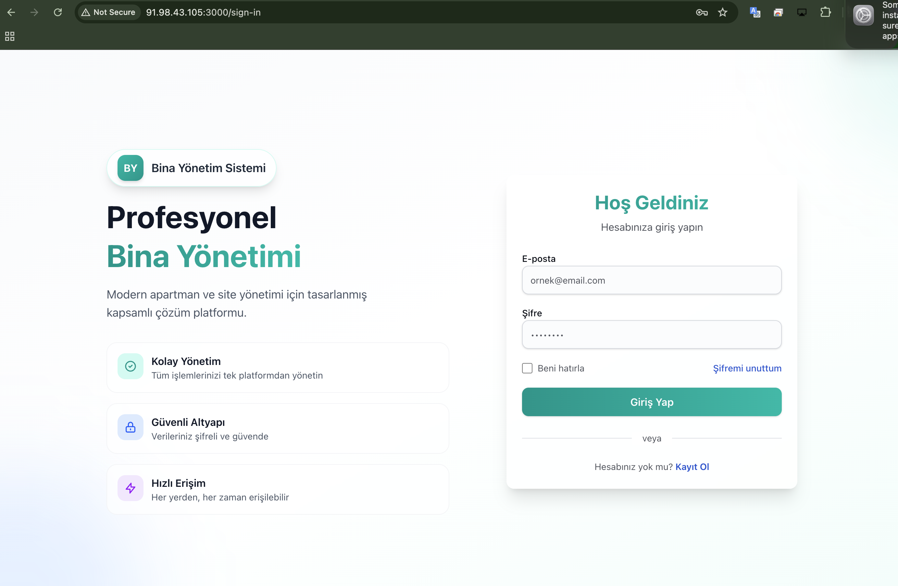

*Giriş sayfası görünümü. E-posta ve şifre ile sisteme giriş yapabilirsiniz.*

### 2.2. Kayıt Olma (İlk Kullanıcılar İçin)

Eğer sistem yöneticiniz tarafından hesap oluşturulmamışsa, kayıt ol sayfasından yeni hesap oluşturabilirsiniz:

1. Giriş sayfasında **"Kayıt Ol"** linkine tıklayın.
2. Kayıt formunu doldurun:
   - Ad Soyad
   - E-posta adresi
   - Şifre (güçlü bir şifre seçin)
   - Şifre tekrar
3. **"Kayıt Ol"** butonuna tıklayın.

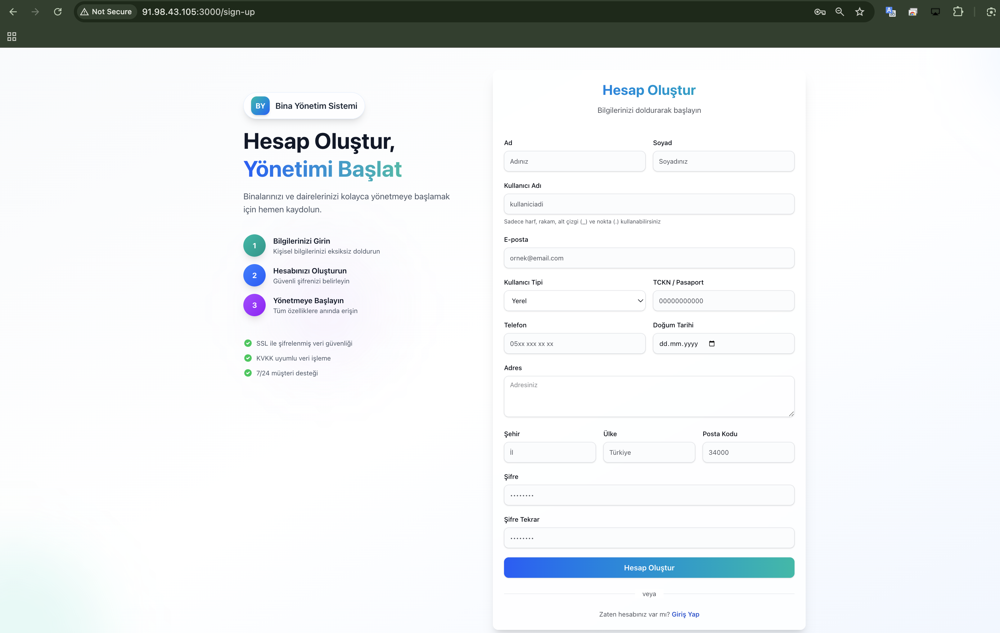

*Kayıt ol sayfası görünümü. Yeni kullanıcı hesabı oluşturabilirsiniz.*

### 2.3. Şifre Değiştirme

1. Sağ üst köşedeki profil menüsüne tıklayın.
2. **"Profil"** seçeneğini seçin.
3. **"Şifre Değiştir"** bölümüne gidin.
4. Mevcut şifrenizi girin.
5. Yeni şifrenizi girin ve tekrar girin.
6. **"Kaydet"** butonuna tıklayın.

### 2.4. Şifremi Unuttum

1. Giriş sayfasında **"Şifremi Unuttum"** linkine tıklayın.
2. E-posta adresinizi girin.
3. Sistem size şifre sıfırlama bağlantısı gönderecektir.
4. E-postanızdaki bağlantıya tıklayarak yeni şifre oluşturun.

---

## 3. Ana Sayfa ve Navigasyon

### 3.1. Ana Sayfa

Giriş yaptıktan sonra ana sayfada şu bilgileri görebilirsiniz:

- **Özet İstatistikler:** Toplam daire sayısı, aktif kullanıcılar, bekleyen aidatlar vb.
- **Son Aktiviteler:** Sistemdeki son işlemler
- **Hızlı Erişim:** Sık kullanılan modüllere hızlı erişim butonları

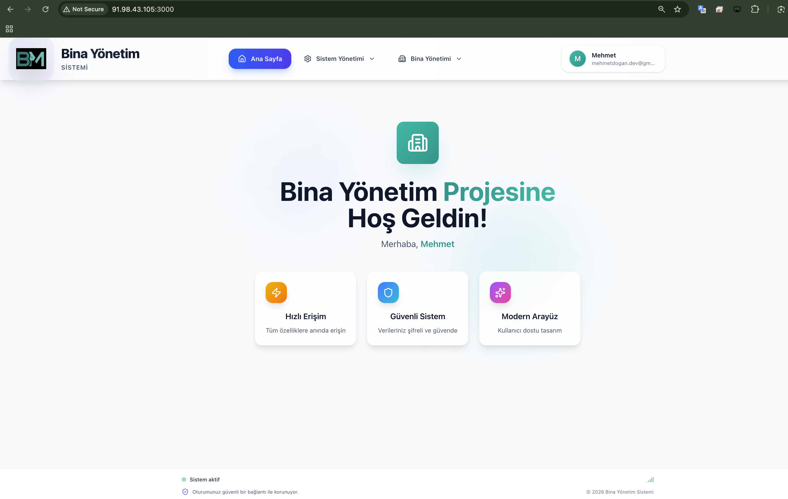

*Ana sayfa görünümü. Sistem özet bilgileri ve hızlı erişim menüleri görüntülenir.*

### 3.2. Menü Yapısı

Sistem iki ana menü grubundan oluşur:

#### **Sistem Yönetimi**
- Kullanıcılar
- Roller
- Rol Grupları
- Mesajlar

#### **Bina Yönetimi**
- Bina Grupları
- Binalar
- Daireler
- Personel
- Aidat Yönetimi
- Duyurular
- Harcamalar
- Toplantılar
- Kararlar
- Şikayetler
- Bakım/Tadilat
- Ziyaretçiler
- Araçlar
- Otopark
- Stok Takibi
- Ürünler

### 3.3. Görünüm Modları

Birçok sayfada **Tablo Görünümü** ve **Görsel Görünüm** arasında geçiş yapabilirsiniz:

- **Tablo Görünümü:** Detaylı liste görünümü, filtreleme ve sıralama imkanı
- **Görsel Görünüm:** Kart veya timeline görünümü, daha görsel bir deneyim

---

## 4. Sistem Yönetimi

### 4.1. Kullanıcı Yönetimi

Kullanıcı yönetimi modülü, sistemdeki tüm kullanıcıları yönetmenizi sağlar. Bu modül için gerekli izinler:

- **ACCESS:** Kullanıcılar sayfasına erişim (sol menüde "Kullanıcılar" seçeneğini görmek için)
- **READ:** Kullanıcı listesini görüntüleme ve kullanıcı detaylarını görme
- **CREATE:** Yeni kullanıcı oluşturma
- **UPDATE:** Kullanıcı bilgilerini güncelleme
- **DELETE:** Kullanıcı silme

> ⚠️ **Önemli:** Kullanıcı silme işlemi geri alınamaz. Silinen kullanıcıya ait tüm kayıtlar (aidatlar, duyurular vb.) da silinir veya ilişkileri koparılır.

#### 4.1.1. Kullanıcı Listesi

Kullanıcılar sayfasında sistemdeki tüm kullanıcıları görüntüleyebilir, arama ve filtreleme yapabilirsiniz.

**Sayfayı Görüntüleme İzni:**
- Eğer **ACCESS** izniniz varsa: Sol menüde "Kullanıcılar" seçeneğini görürsünüz
- Eğer **READ** izniniz varsa: Sayfayı açabilir ve kullanıcı listesini görebilirsiniz
- Eğer **READ** izniniz yoksa: Sayfayı açmaya çalıştığınızda "Bu sayfayı görüntüleme yetkiniz bulunmamaktadır" mesajı görürsünüz

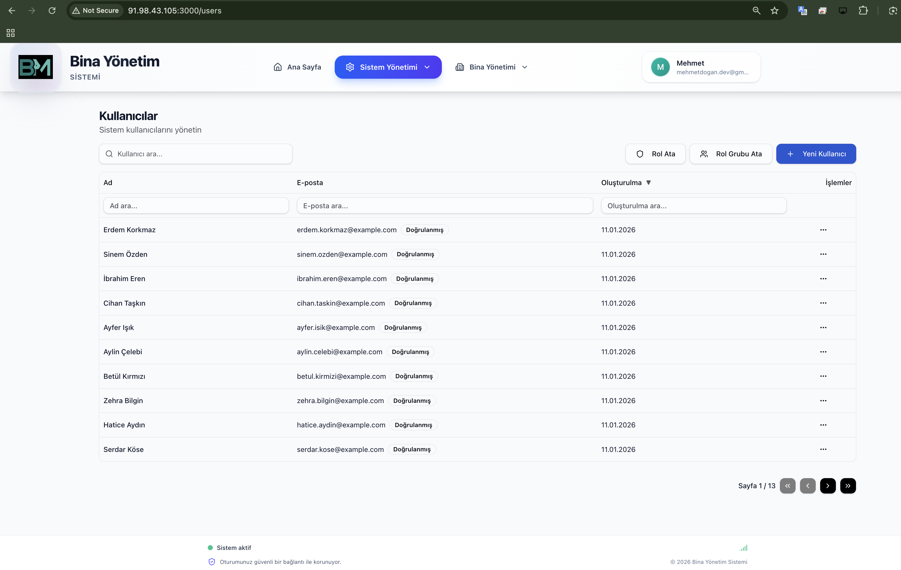

*Kullanıcılar sayfası görünümü. Tüm kullanıcılar tablo formatında listelenir. Eğer CREATE izniniz varsa "Yeni Kullanıcı" butonu görünür.*

#### 4.1.2. Yeni Kullanıcı Ekleme

**İzin Gereksinimi:** CREATE izni gerekir

Eğer CREATE izniniz varsa:
1. **"Sistem Yönetimi"** menüsünden **"Kullanıcılar"** sayfasına gidin.
2. **"Yeni Kullanıcı"** butonuna tıklayın (bu buton sadece CREATE izniniz varsa görünür).
3. Açılan formda:
   - **Ad Soyad:** Kullanıcının tam adı (zorunlu)
   - **E-posta:** Geçerli bir e-posta adresi (zorunlu, sistemde benzersiz olmalı)
   - **Telefon:** İletişim telefonu (opsiyonel)
   - **Şifre:** Geçici şifre (kullanıcı ilk girişte değiştirebilir)
   - **Rol:** Kullanıcının yetki seviyesi (roller ve rol grupları seçilebilir)
4. **"Kaydet"** butonuna tıklayın.

Eğer CREATE izniniz yoksa:
- "Yeni Kullanıcı" butonu görünmez
- Yeni kullanıcı oluşturmaya çalışırsanız "Oluşturma yetkiniz bulunmamaktadır" hatası alırsınız

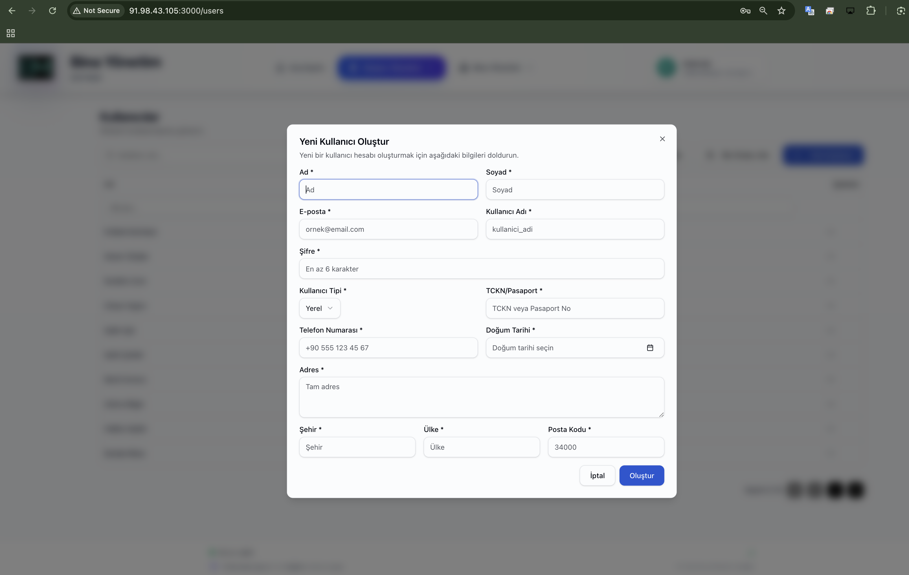

*Yeni kullanıcı oluşturma formu. Tüm gerekli bilgileri girerek kullanıcı ekleyebilirsiniz.*

#### 4.1.3. Kullanıcı İşlemleri

Bir kullanıcı için yapılabilecek işlemler:

- **Detay Görüntüle:** Kullanıcı bilgilerini detaylı görüntüleme
- **Düzenle:** Kullanıcı bilgilerini güncelleme
- **Sil:** Kullanıcıyı sistemden silme
- **Rol Atama:** Kullanıcıya rol atama
- **Rol Grubu Atama:** Kullanıcıya rol grubu atama

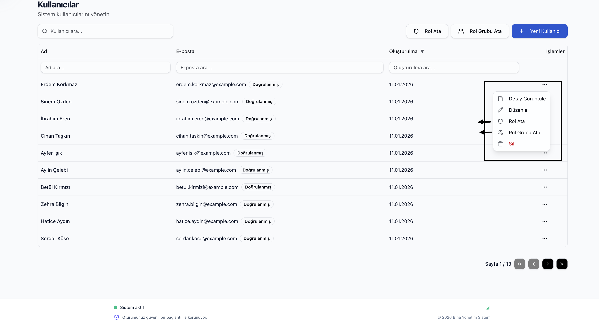

*Kullanıcı için yapılabilecek işlemler menüsü. Detay görüntüleme, düzenleme, silme ve rol atama seçenekleri bulunur.*

#### 4.1.4. Toplu Rol Atama

Birden fazla kullanıcıya aynı anda rol atamak için:

1. Kullanıcılar listesinde rol atamak istediğiniz kullanıcıları seçin.
2. **"Toplu İşlem"** menüsünden **"Rol Ata"** seçeneğini seçin.
3. Açılan pencerede atamak istediğiniz rolü seçin.
4. **"Ata"** butonuna tıklayın.

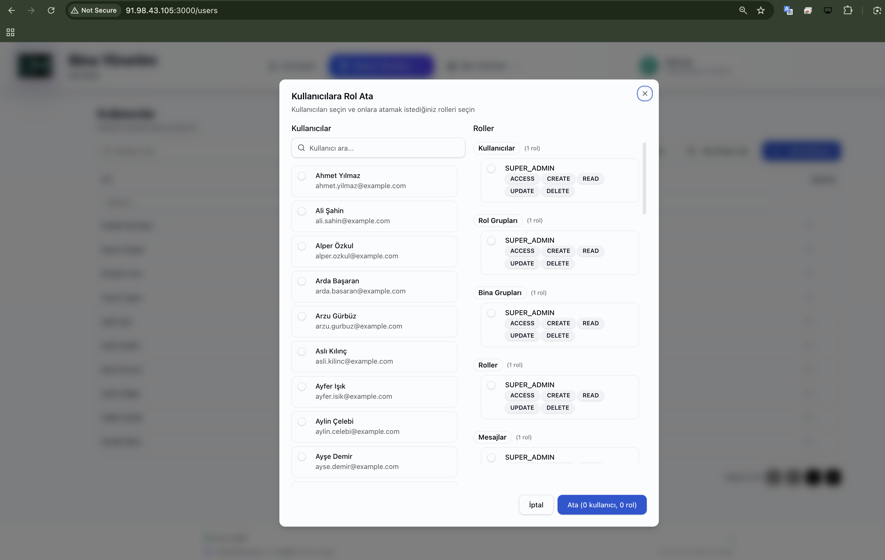

*Birden fazla kullanıcıya toplu rol atama penceresi. Seçili kullanıcılara aynı anda rol atayabilirsiniz.*

#### 4.1.5. Toplu Rol Grubu Atama

Birden fazla kullanıcıya aynı anda rol grubu atamak için:

1. Kullanıcılar listesinde rol grubu atamak istediğiniz kullanıcıları seçin.
2. **"Toplu İşlem"** menüsünden **"Rol Grubu Ata"** seçeneğini seçin.
3. Açılan pencerede atamak istediğiniz rol grubunu seçin.
4. **"Ata"** butonuna tıklayın.

*Birden fazla kullanıcıya toplu rol grubu atama penceresi. Seçili kullanıcılara aynı anda rol grubu atayabilirsiniz.*

#### 4.1.6. Kullanıcı Bilgilerini Güncelleme

**İzin Gereksinimi:** UPDATE izni gerekir

Eğer UPDATE izniniz varsa:
1. Kullanıcılar listesinde güncellemek istediğiniz kullanıcıyı bulun.
2. Satırın sonundaki **"Düzenle"** (kalem) ikonuna tıklayın (bu ikon sadece UPDATE izniniz varsa görünür).
3. Açılan formda bilgileri güncelleyin:
   - Ad Soyad
   - E-posta (değiştirilebilir, ancak sistemde benzersiz olmalı)
   - Telefon
   - Şifre (yeni şifre belirleyebilirsiniz)
   - Rol ve Rol Grupları
4. **"Kaydet"** butonuna tıklayın.

Eğer UPDATE izniniz yoksa:
- "Düzenle" ikonu görünmez
- Kullanıcı bilgilerini güncellemeye çalışırsanız "Güncelleme yetkiniz bulunmamaktadır" hatası alırsınız

**Güncelleme Senaryoları:**

**Senaryo 1: Kullanıcı Şifresini Değiştirme**
- Kullanıcı şifresini unuttuğunda, yönetici yeni şifre belirleyebilir
- Kullanıcı ilk girişte şifresini değiştirebilir

**Senaryo 2: Kullanıcı Rolünü Değiştirme**
- Bir kullanıcının yetkilerini artırmak veya azaltmak için rolü değiştirilebilir
- Rol değişikliği anında etkili olur

**Senaryo 3: Kullanıcı Bilgilerini Düzeltme**
- Yanlış girilmiş e-posta, telefon gibi bilgiler düzeltilebilir

#### 4.1.7. Kullanıcı Silme

**İzin Gereksinimi:** DELETE izni gerekir

Eğer DELETE izniniz varsa:
1. Kullanıcılar listesinde silmek istediğiniz kullanıcıyı bulun.
2. Satırın sonundaki **"Sil"** (çöp kutusu) ikonuna tıklayın (bu ikon sadece DELETE izniniz varsa görünür).
3. Açılan onay penceresinde:
   - Silinecek kullanıcının bilgileri gösterilir
   - Silme işleminin geri alınamayacağı uyarısı verilir
4. **"Evet, Sil"** butonuna tıklayın.

Eğer DELETE izniniz yoksa:
- "Sil" ikonu görünmez
- Kullanıcı silmeye çalışırsanız "Silme yetkiniz bulunmamaktadır" hatası alırsınız

> ⚠️ **Kritik Uyarı:** Kullanıcı silme işlemi geri alınamaz. Silinen kullanıcıya ait:
> - Tüm kayıtlar silinir veya ilişkileri koparılır
> - Aidat kayıtları korunur ancak kullanıcı bilgisi kaldırılır
> - Duyurular, toplantılar gibi kayıtlar korunur ancak kullanıcı bilgisi kaldırılır
> - Mesajlaşma geçmişi korunur ancak kullanıcı bilgisi kaldırılır

#### 4.1.8. Kullanıcı Arama ve Filtreleme

- **Arama Kutusu:** Ad, soyad veya e-posta ile arama yapabilirsiniz.
- **Filtreler:** Rol, durum gibi kriterlere göre filtreleme yapabilirsiniz.

### 4.2. Rol Yönetimi ve Yetkilendirme Sistemi (RBAC)

Roller, kullanıcıların sistemdeki yetki seviyelerini belirler. Sistem, **Rol Tabanlı Erişim Kontrolü (RBAC)** kullanarak güvenli bir yetkilendirme sağlar.

#### 4.2.1. RBAC Sistemi Nasıl Çalışır?

RBAC sistemi, kullanıcıların sistemdeki işlemleri yapabilmesi için gerekli izinleri kontrol eder. Sistem iki seviyede kontrol yapar:

1. **Backend Kontrolü:** Sunucu tarafında her işlem için izin kontrolü yapılır. Bu, güvenlik için zorunludur.
2. **Frontend Kontrolü:** Kullanıcı arayüzünde butonlar ve menüler, kullanıcının izinlerine göre gösterilir veya gizlenir.

#### 4.2.2. İzin Türleri ve Anlamları

Rol oluştururken veya düzenlerken, her modül için 5 farklı izin türü seçebilirsiniz:

##### **ACCESS (Erişim İzni)**
- **Ne İşe Yarar:** Kullanıcının bu modüle erişip erişemeyeceğini belirler.
- **Nerede Kullanılır:** Sol menüde (sidebar) modülün görünürlüğünü kontrol eder.
- **Örnek Senaryo:** Eğer bir kullanıcıya "Kullanıcılar" modülü için ACCESS izni verilmezse, kullanıcı sol menüde "Kullanıcılar" seçeneğini göremez.

##### **READ (Okuma İzni)**
- **Ne İşe Yarar:** Kullanıcının bu modüldeki kayıtları görüntüleyip görüntüleyemeyeceğini belirler.
- **Nerede Kullanılır:** 
  - Sayfa görüntüleme (liste sayfaları)
  - Kayıt detaylarını görüntüleme
  - Raporları görüntüleme
- **Örnek Senaryo:** Eğer bir kullanıcıya "Duyurular" modülü için READ izni verilirse, kullanıcı duyuruları listeleyebilir ve detaylarını görebilir. Ancak yeni duyuru oluşturamaz, düzenleyemez veya silemez.

##### **CREATE (Oluşturma İzni)**
- **Ne İşe Yarar:** Kullanıcının bu modülde yeni kayıt oluşturup oluşturamayacağını belirler.
- **Nerede Kullanılır:**
  - "Yeni Ekle" butonlarının görünürlüğü
  - Yeni kayıt oluşturma formları
  - Toplu kayıt oluşturma işlemleri
- **Örnek Senaryo:** Eğer bir kullanıcıya "Aidat Yönetimi" modülü için CREATE izni verilirse, kullanıcı yeni aidat kayıtları oluşturabilir. Ancak mevcut aidatları düzenleyemez veya silemez.

##### **UPDATE (Güncelleme İzni)**
- **Ne İşe Yarar:** Kullanıcının bu modüldeki mevcut kayıtları düzenleyip düzenleyemeyeceğini belirler.
- **Nerede Kullanılır:**
  - "Düzenle" butonlarının görünürlüğü
  - Kayıt düzenleme formları
  - Durum güncelleme işlemleri
- **Örnek Senaryo:** Eğer bir kullanıcıya "Toplantılar" modülü için UPDATE izni verilirse, kullanıcı mevcut toplantıları düzenleyebilir (tarih, saat, konum vb. değiştirebilir). Ancak yeni toplantı oluşturamaz veya toplantıları silemez.

##### **DELETE (Silme İzni)**
- **Ne İşe Yarar:** Kullanıcının bu modüldeki kayıtları silebilip silemeyeceğini belirler.
- **Nerede Kullanılır:**
  - "Sil" butonlarının görünürlüğü
  - Kayıt silme işlemleri
  - Toplu silme işlemleri
- **Örnek Senaryo:** Eğer bir kullanıcıya "Kullanıcılar" modülü için DELETE izni verilirse, kullanıcı sistemden kullanıcı silebilir. Ancak bu işlem geri alınamaz, bu yüzden dikkatli kullanılmalıdır.

#### 4.2.3. İzin Kombinasyonları ve Pratik Örnekler

Farklı izin kombinasyonları, farklı kullanıcı tipleri için uygundur:

**Sadece READ İzni:**
- **Kullanım:** Sadece bilgi görüntüleme yetkisi olan kullanıcılar için
- **Örnek:** Bir daire sahibi, kendi aidatlarını görebilir ancak değiştiremez
- **Sonuç:** Kullanıcı listeleri görüntüleyebilir, detayları görebilir, ancak hiçbir değişiklik yapamaz

**READ + CREATE İzni:**
- **Kullanım:** Yeni kayıt oluşturabilen ancak mevcut kayıtları değiştiremeyen kullanıcılar için
- **Örnek:** Bir yönetici asistanı, yeni duyuru oluşturabilir ancak mevcut duyuruları düzenleyemez
- **Sonuç:** Kullanıcı yeni kayıtlar oluşturabilir, ancak oluşturduğu kayıtları bile düzenleyemez veya silemez

**READ + CREATE + UPDATE İzni:**
- **Kullanım:** Kayıt oluşturup düzenleyebilen ancak silemeyen kullanıcılar için
- **Örnek:** Bir bina yöneticisi, aidat kayıtları oluşturup güncelleyebilir ancak silme yetkisi yoktur
- **Sonuç:** Kullanıcı kayıtları oluşturabilir ve düzenleyebilir, ancak silemez

**Tüm İzinler (READ + CREATE + UPDATE + DELETE):**
- **Kullanım:** Tam yetkili yöneticiler için
- **Örnek:** Sistem yöneticisi, tüm modüllerde tam yetkiye sahiptir
- **Sonuç:** Kullanıcı tüm işlemleri yapabilir

#### 4.2.4. Roller Sayfası

Roller sayfasında sistemdeki tüm rolleri görüntüleyebilir, yeni rol oluşturabilir veya mevcut rolleri düzenleyebilirsiniz.

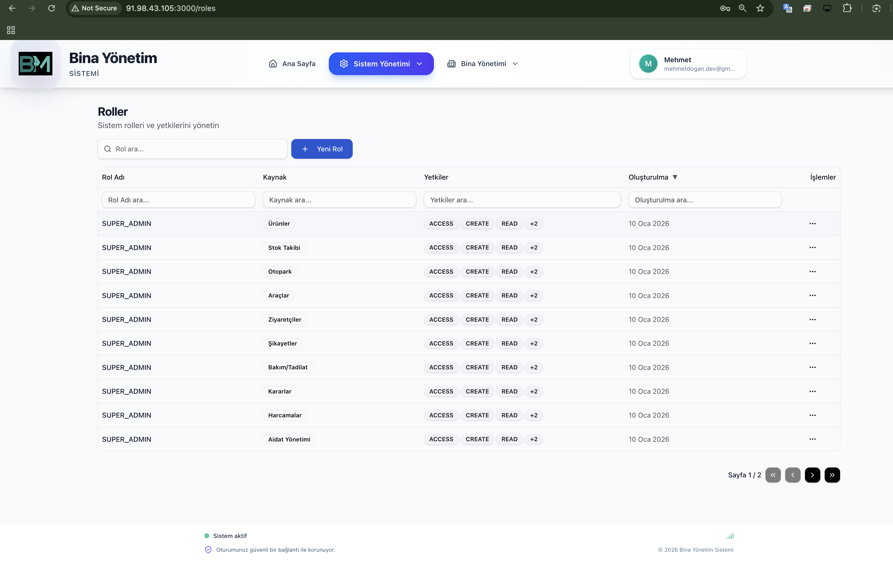

*Roller sayfası görünümü. Tüm roller listelenir ve yönetilebilir. Her rol, hangi modül için hangi izinlere sahip olduğunu gösterir.*

#### 4.2.5. Yeni Rol Oluşturma - Detaylı Anlatım

Rol oluştururken, her modül için ayrı ayrı izinler belirlemeniz gerekir. İşte adım adım süreç:

1. **"Sistem Yönetimi"** menüsünden **"Roller"** sayfasına gidin.
2. **"Yeni Rol"** butonuna tıklayın.
3. Açılan formda:
   - **Rol Adı:** Rolün adı (örnek: "Bina Yöneticisi", "Muhasebeci", "Daire Sahibi")
   - **Açıklama:** Rol hakkında açıklama (opsiyonel ama önerilir)
   - **Modül Seçimi:** Hangi modül için rol oluşturulacağını seçin
4. **İzin Seçimi:** Seçtiğiniz modül için hangi izinlerin verileceğini belirleyin:
   - ✅ **ACCESS:** Modüle erişim izni (genellikle diğer izinlerle birlikte seçilir)
   - ✅ **READ:** Okuma izni (kayıtları görüntüleme)
   - ✅ **CREATE:** Oluşturma izni (yeni kayıt ekleme)
   - ✅ **UPDATE:** Güncelleme izni (mevcut kayıtları düzenleme)
   - ✅ **DELETE:** Silme izni (kayıtları silme)

> 💡 **Önemli Not:** ACCESS izni olmadan diğer izinler işe yaramaz. Önce ACCESS iznini seçmeniz gerekir.

5. **"Kaydet"** butonuna tıklayın.

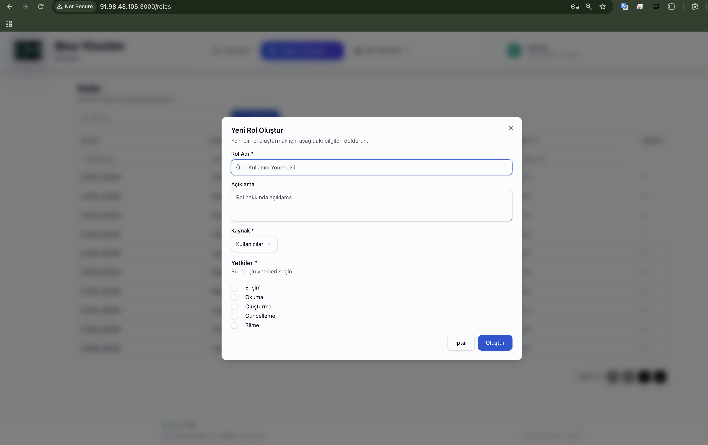

*Yeni rol oluşturma formu. Rol adı, açıklama, modül seçimi ve izinler belirlenir. Her modül için ayrı bir rol oluşturmanız gerekir.*

**Örnek Rol Senaryosu: "Aidat Yöneticisi" Rolü**

Bir kullanıcıya sadece aidat yönetimi yetkisi vermek istiyorsunuz:

1. **Rol Adı:** "Aidat Yöneticisi"
2. **Modül:** "Aidat Yönetimi" (DUES)
3. **İzinler:**
   - ✅ ACCESS (modüle erişim)
   - ✅ READ (aidatları görüntüleme)
   - ✅ CREATE (yeni aidat oluşturma)
   - ✅ UPDATE (aidatları güncelleme)
   - ❌ DELETE (aidat silme - güvenlik için)

Bu rolü alan kullanıcı:
- ✅ Aidat Yönetimi sayfasını görebilir
- ✅ Tüm aidatları listeleyebilir
- ✅ Yeni aidat kayıtları oluşturabilir
- ✅ Mevcut aidatları düzenleyebilir
- ❌ Aidatları silemez

#### 4.2.6. Rol İzinlerini Düzenleme

1. Roller listesinde düzenlemek istediğiniz rolü bulun.
2. **"Düzenle"** ikonuna tıklayın.
3. İzinleri güncelleyin:
   - Yeni izinler ekleyebilirsiniz
   - Mevcut izinleri kaldırabilirsiniz
   - İzinler anında kullanıcılara yansır
4. **"Kaydet"** butonuna tıklayın.

> ⚠️ **Uyarı:** Bir izni kaldırdığınızda, o izne sahip tüm kullanıcılar artık o işlemi yapamaz. Bu değişiklik anında etkili olur.

#### 4.2.7. Modül Bazında İzin Gereksinimleri

Her modül için hangi izinlerin hangi işlemler için gerekli olduğu:

| Modül | Sayfa Görüntüleme | Liste Görüntüleme | Detay Görüntüleme | Yeni Ekleme | Düzenleme | Silme |
|-------|------------------|-------------------|-------------------|-------------|-----------|-------|
| Kullanıcılar | ACCESS | READ | READ | CREATE | UPDATE | DELETE |
| Roller | ACCESS | READ | READ | CREATE | UPDATE | DELETE |
| Rol Grupları | ACCESS | READ | READ | CREATE | UPDATE | DELETE |
| Mesajlar | ACCESS | READ | READ | CREATE | - | - |
| Bina Grupları | ACCESS | READ | READ | CREATE | UPDATE | DELETE |
| Binalar | ACCESS | READ | READ | CREATE | UPDATE | DELETE |
| Daireler | ACCESS | READ | READ | CREATE | UPDATE | DELETE |
| Personel | ACCESS | READ | READ | CREATE | UPDATE | DELETE |
| Aidat Yönetimi | ACCESS | READ | READ | CREATE | UPDATE | DELETE |
| Duyurular | ACCESS | READ | READ | CREATE | UPDATE | DELETE |
| Harcamalar | ACCESS | READ | READ | CREATE | UPDATE | DELETE |
| Toplantılar | ACCESS | READ | READ | CREATE | UPDATE | DELETE |
| Kararlar | ACCESS | READ | READ | CREATE | UPDATE | DELETE |
| Şikayetler | ACCESS | READ | READ | CREATE | UPDATE | DELETE |
| Bakım/Tadilat | ACCESS | READ | READ | CREATE | UPDATE | DELETE |
| Ziyaretçiler | ACCESS | READ | READ | CREATE | UPDATE | DELETE |
| Araçlar | ACCESS | READ | READ | CREATE | UPDATE | DELETE |
| Otopark | ACCESS | READ | READ | CREATE | UPDATE | DELETE |
| Stok Takibi | ACCESS | READ | READ | CREATE | UPDATE | DELETE |
| Ürünler | ACCESS | READ | READ | CREATE | UPDATE | DELETE |

> 💡 **Not:** Mesajlaşma modülünde UPDATE ve DELETE izinleri kullanılmaz çünkü mesajlar düzenlenemez veya silinemez (sadece okundu olarak işaretlenebilir).

### 4.3. Rol Grupları

Rol grupları, benzer yetkilere sahip rolleri bir araya getirir.

#### 4.3.1. Rol Grubu Listesi

Rol grupları sayfasında tüm rol gruplarını görüntüleyebilirsiniz.

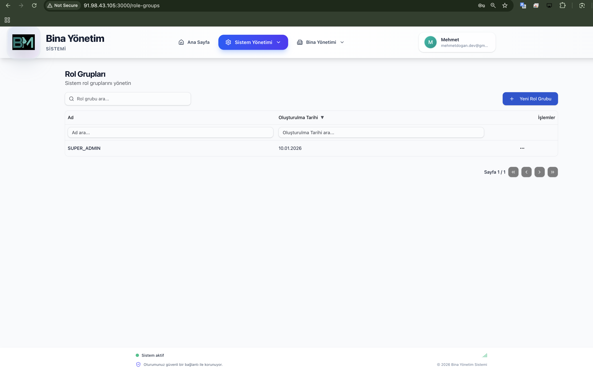

*Rol grupları sayfası görünümü. Tüm rol grupları listelenir.*

#### 4.3.2. Rol Grubu Oluşturma

1. **"Sistem Yönetimi"** menüsünden **"Rol Grupları"** sayfasına gidin.
2. **"Yeni Rol Grubu"** butonuna tıklayın.
3. Açılan formda:
   - **Grup Adı:** Rol grubunun adı
   - **Açıklama:** Grup hakkında açıklama
4. Bu gruba dahil edilecek **rolleri** seçin.
5. **"Kaydet"** butonuna tıklayın.

### 4.4. Mesajlaşma Sistemi

Sistem içi mesajlaşma özelliği ile kullanıcılar arasında gerçek zamanlı iletişim kurabilirsiniz. Mesajlaşma sistemi, **gerçek zamanlı (real-time)** çalışır ve anında mesaj gönderimi sağlar.

#### 4.4.1. Mesajlaşma Sisteminin Özellikleri

- **Gerçek Zamanlı Mesajlaşma:** Mesajlar anında gönderilir ve alınır (WebSocket teknolojisi)
- **İki Tip Konuşma:** Direkt mesajlaşma (1-1) ve grup mesajlaşma (çoklu kullanıcı)
- **Mesaj Geçmişi:** Tüm mesajlar kaydedilir ve görüntülenebilir
- **Okundu Bilgisi:** Mesajların okunup okunmadığı takip edilir
- **Yazıyor Göstergesi:** Karşı tarafın yazıp yazmadığı görüntülenir

#### 4.4.2. Mesajlaşma Arayüzü

Mesajlar sayfası iki bölümden oluşur:

1. **Sol Panel:** Konuşma listesi (Direkt ve Grup konuşmaları)
2. **Sağ Panel:** Seçili konuşmanın mesaj görünümü

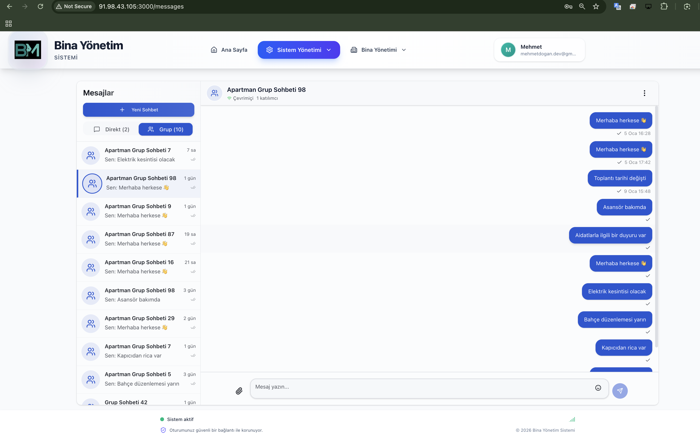

*Grup mesajlaşma alanı. Birden fazla kullanıcıyla aynı anda mesajlaşabilirsiniz. Sol tarafta konuşma listesi, sağ tarafta mesaj görünümü görüntülenir.*

#### 4.4.3. Direkt Mesajlaşma (1-1 Konuşma)

Direkt mesajlaşma, iki kullanıcı arasında özel konuşma yapmanızı sağlar.

**Yeni Direkt Konuşma Başlatma:**

1. **"Sistem Yönetimi"** menüsünden **"Mesajlar"** sayfasına gidin.
2. Sol panelde **"Direkt"** sekmesine tıklayın (varsayılan olarak açıktır).
3. **"Yeni Konuşma"** butonuna tıklayın.
4. Açılan pencerede:
   - **Konuşma Tipi:** "Direkt" seçeneğini seçin
   - **Alıcı:** Mesajlaşmak istediğiniz kullanıcıyı seçin (tek kullanıcı)
5. **"Oluştur"** butonuna tıklayın.
6. Konuşma otomatik olarak açılır ve mesaj göndermeye başlayabilirsiniz.

**Mevcut Direkt Konuşmaya Mesaj Gönderme:**

1. Sol panelde konuşmak istediğiniz kullanıcıyı seçin.
2. Sağ panelde mesaj yazma alanına mesajınızı yazın.
3. **"Gönder"** butonuna tıklayın veya **Enter** tuşuna basın.
4. Mesaj anında gönderilir ve karşı taraf görür.

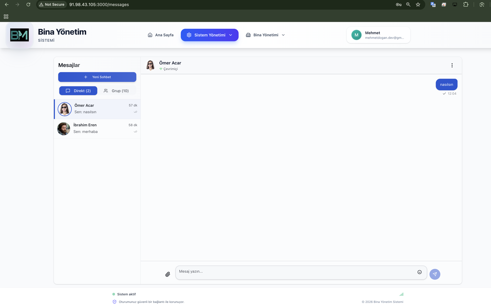

*Direkt mesajlaşma görünümü. Tek bir kullanıcıyla özel mesajlaşabilirsiniz. Mesajlar gerçek zamanlı olarak gönderilir ve alınır.*

**Direkt Mesajlaşma Özellikleri:**

- ✅ Sadece iki kullanıcı arasında
- ✅ Özel ve gizli konuşma
- ✅ Mesaj geçmişi saklanır
- ✅ Okundu bilgisi gösterilir
- ✅ Gerçek zamanlı güncelleme

#### 4.4.4. Grup Mesajlaşma

Grup mesajlaşma, birden fazla kullanıcıyla aynı anda konuşmanızı sağlar.

**Yeni Grup Konuşması Oluşturma:**

1. **"Mesajlar"** sayfasında sol panelde **"Grup"** sekmesine tıklayın.
2. **"Yeni Grup"** butonuna tıklayın.
3. Açılan pencerede:
   - **Konuşma Tipi:** "Grup" seçeneğini seçin
   - **Grup Adı:** Grubun adını girin (örnek: "Yönetim Kurulu", "Bina Yöneticileri")
   - **Katılımcılar:** Gruba dahil edilecek kullanıcıları seçin (birden fazla seçim yapabilirsiniz)
   - **Gizlilik:** Grup gizli mi yoksa herkese açık mı? (varsayılan: gizli)
4. **"Oluştur"** butonuna tıklayın.
5. Grup konuşması oluşturulur ve otomatik olarak açılır.

**Grup Mesajı Gönderme:**

1. Sol panelde grup konuşmasını seçin.
2. Sağ panelde mesaj yazma alanına mesajınızı yazın.
3. **"Gönder"** butonuna tıklayın.
4. Mesaj tüm grup üyelerine anında gönderilir.

**Grup Mesajlaşma Özellikleri:**

- ✅ Birden fazla kullanıcıyla aynı anda konuşma
- ✅ Grup adı ve açıklaması
- ✅ Grup üyeleri yönetimi (sadece grup sahibi/admin)
- ✅ Tüm grup üyeleri mesajları görür
- ✅ Gerçek zamanlı güncelleme

#### 4.4.5. Mesaj Gönderme ve Alındı Bilgisi

**Mesaj Gönderme:**

1. Konuşma seçildikten sonra, sağ alttaki mesaj yazma alanına mesajınızı yazın.
2. **"Gönder"** butonuna tıklayın veya **Enter** tuşuna basın.
3. Mesaj anında gönderilir ve görünür.

**Mesaj Durumları:**

- **Gönderildi:** Mesaj başarıyla gönderildi (saat ikonu)
- **Okundu:** Mesaj karşı taraf tarafından okundu (çift tik işareti)
- **Yazılıyor:** Karşı taraf mesaj yazıyor (animasyonlu gösterge)

**Okundu Bilgisi:**

- Mesajlarınız, karşı taraf tarafından okunduğunda otomatik olarak "Okundu" olarak işaretlenir.
- Direkt mesajlarda: Mesaj karşı taraf tarafından görüntülendiğinde okundu sayılır.
- Grup mesajlarında: Mesaj, grup üyelerinden en az biri tarafından okunduğunda okundu sayılır.

#### 4.4.6. Mesaj Geçmişi ve Arama

**Mesaj Geçmişi:**

- Tüm mesajlar sistemde saklanır ve görüntülenebilir.
- Konuşma geçmişi, sayfa yenilendiğinde veya tekrar açıldığında korunur.
- Eski mesajlar otomatik olarak yüklenir (scroll up yaparak).

**Mesaj Arama:**

1. Sol panelde arama kutusuna arama terimi girin.
2. Konuşmalar ve mesajlar içinde arama yapılır.
3. Sonuçlar anında gösterilir.

#### 4.4.7. Konuşma Yönetimi

**Konuşma Listesi:**

- Sol panelde tüm konuşmalarınız listelenir.
- En son mesaj gönderilen konuşmalar üstte görünür.
- Okunmamış mesaj sayısı konuşma yanında gösterilir.

**Konuşma Seçme:**

- Sol panelde bir konuşmaya tıklayarak seçebilirsiniz.
- Seçili konuşma vurgulanır.
- Sağ panelde seçili konuşmanın mesajları görüntülenir.

**Konuşma Bilgileri:**

- Konuşma başlığı (grup adı veya diğer kullanıcının adı)
- Son mesaj zamanı
- Okunmamış mesaj sayısı
- Katılımcı sayısı (grup konuşmalarında)

#### 4.4.8. Gerçek Zamanlı Özellikler

Sistem, WebSocket teknolojisi kullanarak gerçek zamanlı mesajlaşma sağlar:

**Anında Mesaj Gönderimi:**
- Mesaj gönderildiğinde anında karşı tarafa ulaşır.
- Sayfa yenilemeye gerek yoktur.
- Mesajlar otomatik olarak görünür.

**Yazıyor Göstergesi:**
- Karşı taraf mesaj yazarken "Yazıyor..." göstergesi görünür.
- Bu, kullanıcı deneyimini iyileştirir.

**Bağlantı Durumu:**
- Sağ üst köşede bağlantı durumu gösterilir:
  - 🟢 **Bağlı:** Normal çalışıyor
  - 🔴 **Bağlantı Yok:** İnternet bağlantısı yok, mesajlar gönderilemez

**Otomatik Yeniden Bağlanma:**
- Bağlantı kesildiğinde sistem otomatik olarak yeniden bağlanmaya çalışır.
- Bağlantı kurulduğunda bekleyen mesajlar otomatik gönderilir.

#### 4.4.9. Mesajlaşma İzinleri

Mesajlaşma modülü için gerekli izinler:

- **ACCESS:** Mesajlar sayfasına erişim (sol menüde görünürlük)
- **READ:** Konuşmaları ve mesajları görüntüleme
- **CREATE:** Yeni konuşma oluşturma ve mesaj gönderme

> 💡 **Not:** Mesajlaşma modülünde UPDATE ve DELETE izinleri kullanılmaz çünkü:
> - Mesajlar düzenlenemez (gönderildikten sonra değiştirilemez)
> - Mesajlar silinemez (sadece okundu olarak işaretlenebilir)

**Örnek İzin Senaryoları:**

**Sadece Okuma İzni (READ):**
- Kullanıcı mesajları görebilir
- Ancak yeni konuşma oluşturamaz veya mesaj gönderemez

**Okuma + Oluşturma İzni (READ + CREATE):**
- Kullanıcı mesajları görebilir
- Yeni konuşma oluşturabilir
- Mesaj gönderebilir
- Ancak mesajları düzenleyemez veya silemez (zaten mümkün değil)

#### 4.4.10. Mesajlaşma İpuçları ve En İyi Uygulamalar

**Etkili Mesajlaşma:**

1. **Açık ve Net Mesajlar:** Mesajlarınızı kısa ve öz tutun
2. **Uygun Grup Kullanımı:** Genel konular için grup, özel konular için direkt mesaj kullanın
3. **Grup Adlandırma:** Gruplara anlamlı isimler verin (örnek: "A Blok Yönetimi", "Acil Durumlar")
4. **Zamanında Yanıt:** Mesajlara zamanında yanıt verin

**Güvenlik:**

- Mesajlar sistemde saklanır ve yedeklenir
- Sadece konuşmaya dahil olan kullanıcılar mesajları görebilir
- Gizli gruplar, sadece grup üyeleri tarafından görülebilir

**Performans:**

- Çok sayıda mesaj içeren konuşmalarda, eski mesajlar otomatik olarak yüklenir
- Gerçek zamanlı güncellemeler, sayfa yenilemeye gerek kalmadan çalışır

---

## 5. Bina Yönetimi Temel Kurulum

Sistemi kullanmaya başlamadan önce, bina yapısını sisteme kaydetmeniz gerekir. Bu işlem aşağıdaki sırayla yapılmalıdır:

1. **Bina Grupları** → 2. **Binalar/Bloklar** → 3. **Daireler** → 4. **Kullanıcı-Daire Eşleştirmesi**

### 5.1. Bina Grupları Oluşturma

Bina grubu, birden fazla binayı bir araya getiren üst yapıdır (örnek: Site, Rezidans kompleksi).

#### 5.1.1. Bina Grupları Görünüm Modları

Bina grupları sayfasında iki farklı görünüm modu bulunur:

**Tablo Görünümü:**
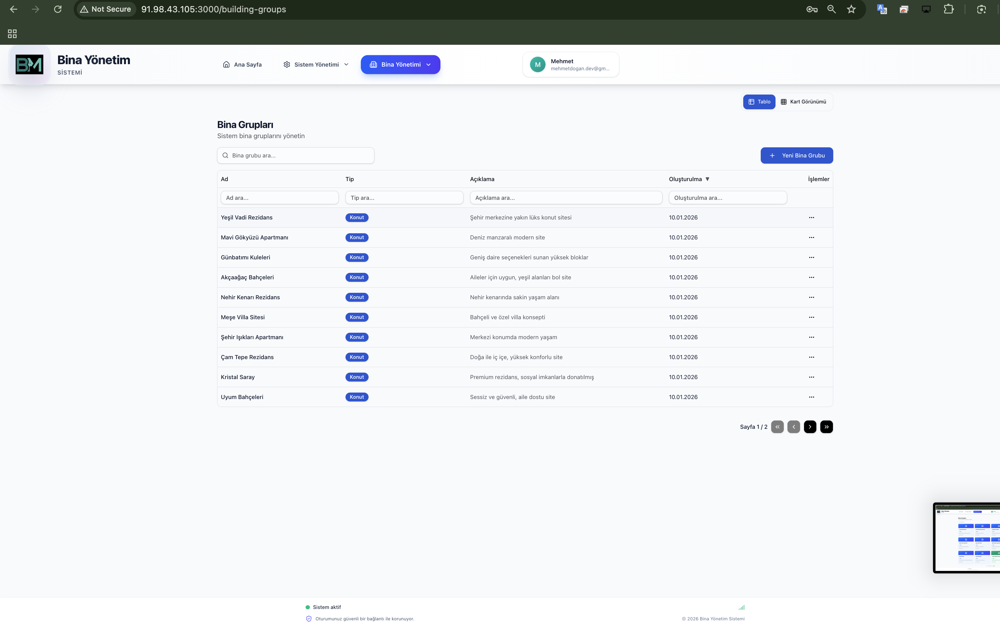

*Bina grupları tablo görünümü. Tüm bina grupları detaylı liste halinde görüntülenir.*

**Kart Görünümü:**
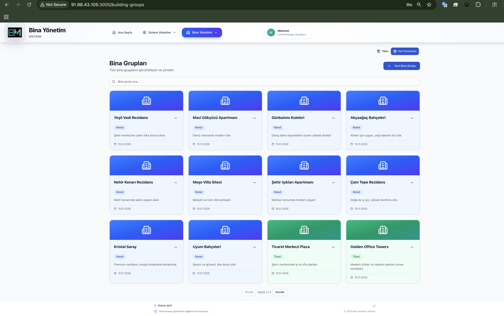

*Bina grupları kart görünümü. Bina grupları görsel kartlar halinde görüntülenir.*

#### 5.1.2. Yeni Bina Grubu Ekleme

1. **"Bina Yönetimi"** menüsünden **"Bina Grupları"** sayfasına gidin.
2. **"Yeni Bina Grubu"** butonuna tıklayın.
3. Açılan formda:
   - **Grup Adı:** Örn: "Yeşil Vadi Sitesi"
   - **Açıklama:** Grup hakkında bilgi (opsiyonel)
   - **Adres:** Grup adresi
   - **İletişim Bilgileri:** Telefon, e-posta vb.
4. **"Kaydet"** butonuna tıklayın.

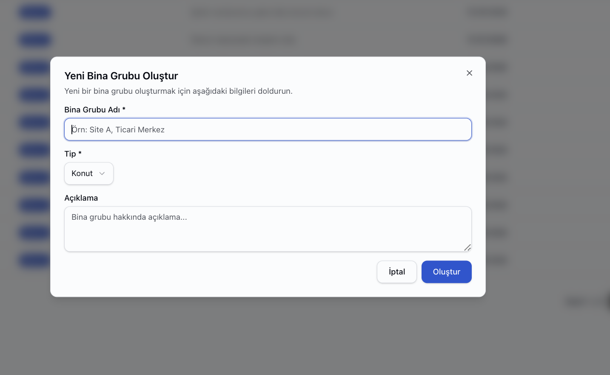

*Yeni bina grubu oluşturma formu. Bina grubu bilgileri girilerek kayıt oluşturulur.*

#### 5.1.3. Bina Grubu Güncelleme

1. Bina grupları listesinde güncellemek istediğiniz grubu bulun.
2. **"Düzenle"** ikonuna tıklayın.
3. Bilgileri güncelleyin.
4. **"Kaydet"** butonuna tıklayın.

### 5.2. Bina/Blok Kayıtları

Bina grubuna ait binaları (blokları) sisteme kaydedin.

#### 5.2.1. Binalar 2D Görünümü

Binalar sayfasında binaları 2D görünümde görüntüleyebilirsiniz.

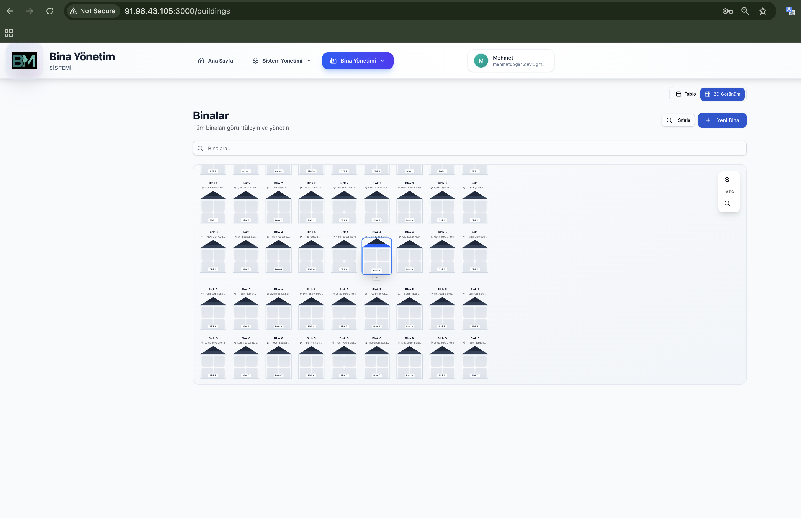

*Binalar 2D görünümü. Binalar görsel olarak 2D plan şeklinde görüntülenir.*

#### 5.2.2. Yeni Bina Ekleme

1. **"Bina Yönetimi"** menüsünden **"Binalar"** sayfasına gidin.
2. **"Yeni Bina"** butonuna tıklayın.
3. Açılan formda:
   - **Bina Grubu:** Hangi bina grubuna ait olduğunu seçin
   - **Bina Adı:** Örn: "A Blok", "1. Bina"
   - **Adres:** Bina adresi
   - **Kat Sayısı:** Binadaki toplam kat sayısı
   - **Daire Sayısı:** Binadaki toplam daire sayısı
   - **Yapım Yılı:** Bina yapım yılı (opsiyonel)
4. **"Kaydet"** butonuna tıklayın.

#### 5.2.3. Bina Detaylarını Görüntüleme

1. Binalar listesinde görüntülemek istediğiniz binaya tıklayın.
2. Bina detay sayfasında:
   - Bina bilgileri
   - Binaya ait daireler listesi
   - Binaya ait personel listesi
   - Binaya ait duyurular
   - Binaya ait toplantılar
   gibi bilgileri görebilirsiniz.

### 5.3. Daire Kayıtları

Her binaya ait daireleri sisteme kaydedin.

#### 5.3.1. Daireler 2D Görünümü

Daireler sayfasında daireleri 2D görünümde görüntüleyebilirsiniz.

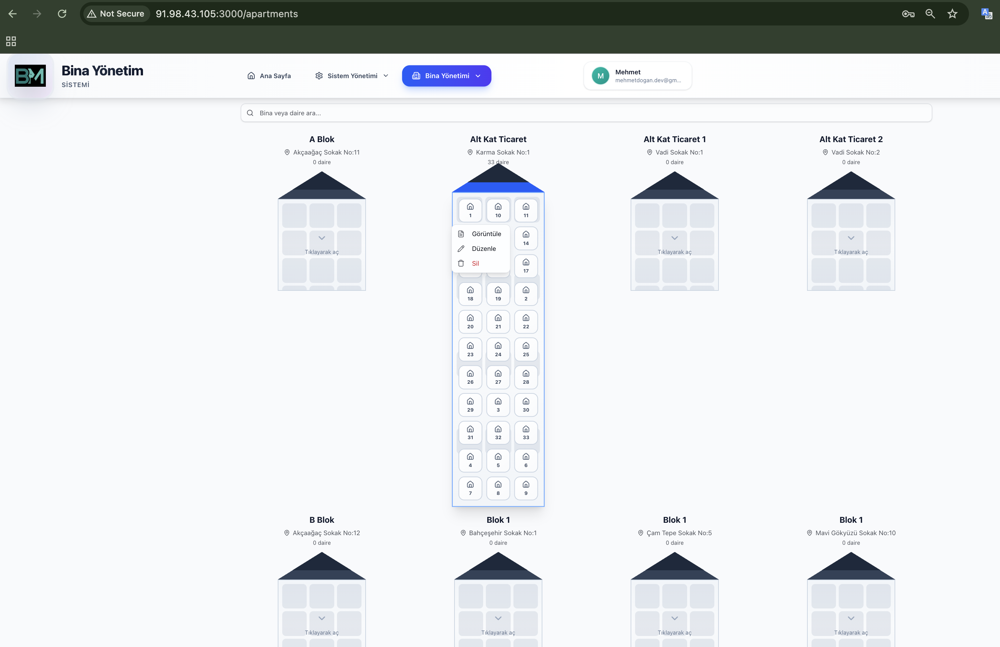

*Daireler 2D görünümü. Daireler binanın kat planı üzerinde görsel olarak görüntülenir.*

#### 5.3.2. Yeni Daire Ekleme

1. **"Bina Yönetimi"** menüsünden **"Daireler"** sayfasına gidin.
2. **"Yeni Daire"** butonuna tıklayın.
3. Açılan formda:
   - **Bina:** Dairenin hangi binaya ait olduğunu seçin
   - **Daire Numarası:** Örn: "1", "2A", "15"
   - **Kat:** Dairenin bulunduğu kat
   - **Daire Tipi:** Örn: "2+1", "3+1", "4+1"
   - **Metrekare:** Daire alanı
   - **Oda Sayısı:** Toplam oda sayısı
   - **Balkon:** Balkon var mı? (Evet/Hayır)
   - **Açıklama:** Ek bilgiler (opsiyonel)
4. **"Kaydet"** butonuna tıklayın.

#### 5.3.3. Daire Detay Sayfası

Daire detay sayfasında daire hakkında tüm bilgileri görüntüleyebilirsiniz.

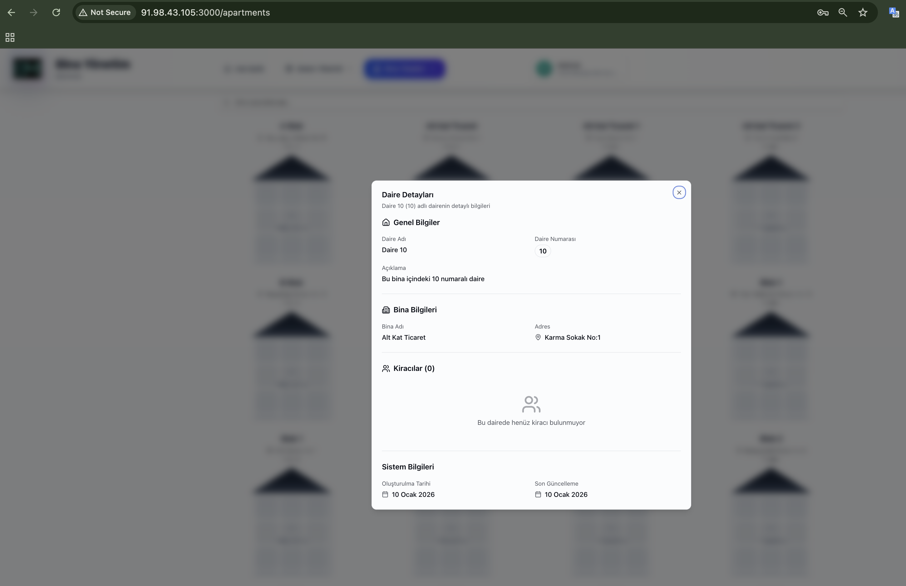

*Daire detay sayfası. Daire bilgileri, daire sakinleri, aidat kayıtları ve diğer bilgiler görüntülenir.*

#### 5.3.4. Toplu Daire Ekleme

Birden fazla daireyi tek seferde eklemek için:

1. **"Daireler"** sayfasında **"Toplu Ekle"** butonuna tıklayın.
2. **Bina** seçin.
3. **Başlangıç Daire No** ve **Bitiş Daire No** girin.
4. **Kat Bilgisi** girin (tüm daireler aynı katta ise).
5. **Daire Tipi** ve diğer ortak bilgileri girin.
6. **"Oluştur"** butonuna tıklayın.

> 💡 **İpucu:** Toplu ekleme özelliği, aynı özelliklere sahip daireleri hızlıca eklemek için idealdir.

### 5.4. Kullanıcı-Daire Eşleştirmesi

Dairelere kullanıcıları atayarak, hangi kullanıcının hangi dairede oturduğunu belirleyin.

#### 5.4.1. Daireye Kullanıcı Atama

1. **"Daireler"** sayfasında, kullanıcı atamak istediğiniz daireyi bulun.
2. **"Düzenle"** ikonuna tıklayın.
3. **"Daire Sakinleri"** bölümüne gidin.
4. **"Kullanıcı Ekle"** butonuna tıklayın.
5. Açılan listeden kullanıcıyı seçin.
6. **"Kaydet"** butonuna tıklayın.

#### 5.4.2. Daire Sahipliği Belirleme

1. Daire düzenleme sayfasında, **"Daire Sahibi"** alanından sahibi seçin.
2. **"Kaydet"** butonuna tıklayın.

> 💡 **Not:** Bir daireye birden fazla kullanıcı atanabilir (örnek: eş, çocuklar).

---

## 6. Personel Yönetimi

Bina yönetiminde çalışan personelleri sisteme kaydedin ve yönetin.

### 6.1. Personel Listesi

Personel sayfasında tüm personelleri görüntüleyebilir, yeni personel ekleyebilir veya mevcut personel bilgilerini güncelleyebilirsiniz.

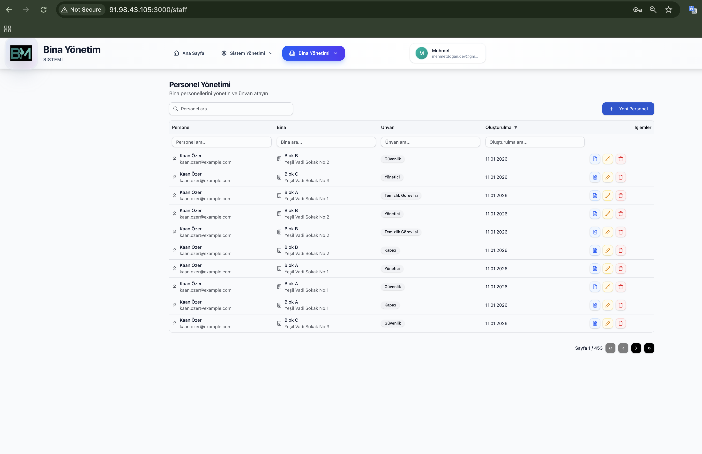

*Personel yönetimi sayfası. Tüm personeller listelenir ve yönetilebilir.*

### 6.2. Yeni Personel Ekleme

1. **"Bina Yönetimi"** menüsünden **"Personel"** sayfasına gidin.
2. **"Yeni Personel"** butonuna tıklayın.
3. Açılan formda:
   - **Ad Soyad:** Personelin tam adı
   - **TC Kimlik No:** TC kimlik numarası
   - **Telefon:** İletişim telefonu
   - **E-posta:** E-posta adresi (opsiyonel)
   - **Görev:** Örn: "Kapıcı", "Güvenlik", "Temizlik"
   - **Bina:** Hangi binada çalıştığı
   - **İşe Başlama Tarihi:** İşe başlama tarihi
   - **Maaş:** Aylık maaş bilgisi
   - **Açıklama:** Ek bilgiler
4. **"Kaydet"** butonuna tıklayın.

### 6.3. Personel Bilgilerini Güncelleme

1. Personel listesinde güncellemek istediğiniz personeli bulun.
2. **"Düzenle"** ikonuna tıklayın.
3. Bilgileri güncelleyin.
4. **"Kaydet"** butonuna tıklayın.

### 6.4. Personel Maaş Ödemeleri

1. Personel detay sayfasında **"Maaş Ödemeleri"** sekmesine gidin.
2. **"Yeni Ödeme"** butonuna tıklayın.
3. **Ödeme Tarihi**, **Tutar** ve **Açıklama** bilgilerini girin.
4. **"Kaydet"** butonuna tıklayın.

> 💡 **Not:** Maaş ödemeleri, harcama kayıtlarına otomatik olarak yansır.

---

## 7. Aidat Yönetimi

Aidat takibi, ödeme kayıtları ve borç takibi yapabilirsiniz. Bu modül için gerekli izinler:

- **ACCESS:** Aidat Yönetimi sayfasına erişim (sol menüde "Aidat Yönetimi" seçeneğini görmek için)
- **READ:** Aidat listesini görüntüleme, aidat detaylarını görme, raporları görüntüleme
- **CREATE:** Yeni aidat kaydı oluşturma, toplu aidat oluşturma
- **UPDATE:** Aidat bilgilerini güncelleme, ödeme kaydı yapma
- **DELETE:** Aidat kaydını silme (nadiren kullanılır, genellikle yanlış kayıtlar için)

> 💡 **Pratik Kullanım:** Çoğu durumda aidat yöneticileri READ + CREATE + UPDATE izinlerine sahiptir. DELETE izni genellikle sadece sistem yöneticilerine verilir.

### 7.1. Aidat Yönetimi Sayfası

Aidat yönetimi sayfasında tüm aidat kayıtlarını görüntüleyebilir, yeni aidat oluşturabilir ve ödeme kayıtları yapabilirsiniz.

**Sayfayı Görüntüleme:**
- **ACCESS** izniniz varsa: Sol menüde "Aidat Yönetimi" seçeneğini görürsünüz
- **READ** izniniz varsa: Sayfayı açabilir ve aidat listesini görebilirsiniz
- **READ** izniniz yoksa: Sayfayı açmaya çalıştığınızda erişim hatası alırsınız

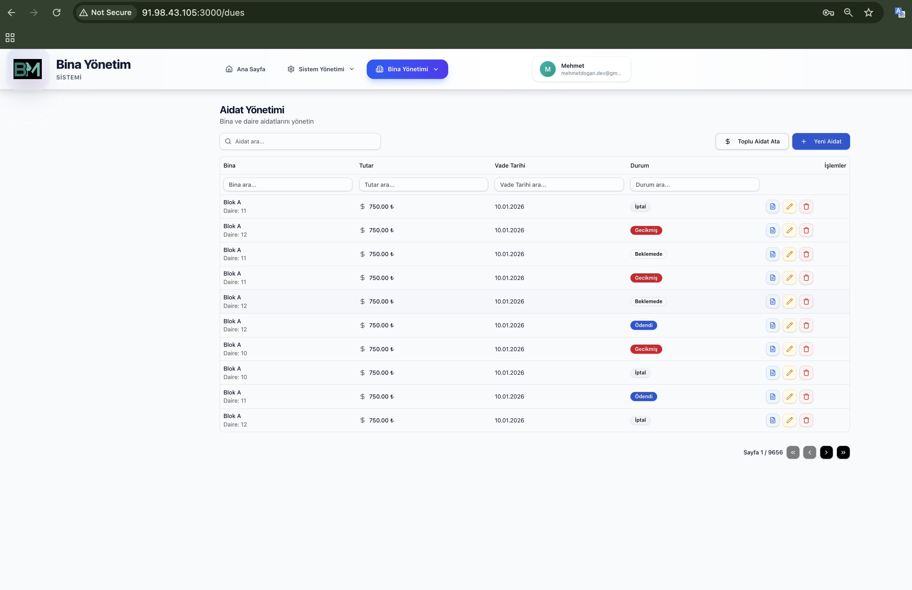

*Aidat yönetimi sayfası. Tüm aidat kayıtları listelenir ve yönetilebilir. Eğer CREATE izniniz varsa "Yeni Aidat" butonu görünür.*

### 7.2. Yeni Aidat Kaydı Oluşturma

**İzin Gereksinimi:** CREATE izni gerekir

Eğer CREATE izniniz varsa:
1. **"Bina Yönetimi"** menüsünden **"Aidat Yönetimi"** sayfasına gidin.
2. **"Yeni Aidat"** butonuna tıklayın (bu buton sadece CREATE izniniz varsa görünür).
3. Açılan formda:
   - **Daire:** Hangi daire için aidat oluşturulacak (zorunlu, dropdown'dan seçilir)
   - **Dönem:** Örn: "Ocak 2025", "Şubat 2025" (zorunlu, format: "Ay Yıl")
   - **Tutar:** Aidat tutarı (zorunlu, sayısal değer)
   - **Son Ödeme Tarihi:** Son ödeme tarihi (zorunlu, takvimden seçilir)
   - **Açıklama:** Ek bilgiler (opsiyonel, örn: "Ocak ayı aidatı")
4. **"Kaydet"** butonuna tıklayın.

**Örnek Senaryo:**
- Bir daire için Ocak 2025 aidatı oluşturuluyor
- Tutar: 500 TL
- Son ödeme tarihi: 31 Ocak 2025
- Sistem otomatik olarak aidat kaydını oluşturur ve daire sahibine bildirim gönderilebilir

Eğer CREATE izniniz yoksa:
- "Yeni Aidat" butonu görünmez
- Yeni aidat oluşturmaya çalışırsanız "Oluşturma yetkiniz bulunmamaktadır" hatası alırsınız

### 7.3. Toplu Aidat Oluşturma

Tüm daireler için aynı dönemde aidat oluşturmak için:

1. **"Aidat Yönetimi"** sayfasında **"Toplu Oluştur"** butonuna tıklayın.
2. **Bina** veya **Bina Grubu** seçin.
3. **Dönem** seçin.
4. **Tutar** girin (tüm daireler için aynı tutar).
5. **Son Ödeme Tarihi** belirleyin.
6. **"Oluştur"** butonuna tıklayın.

### 7.4. Aidat Ödemesi Kaydetme

**İzin Gereksinimi:** UPDATE izni gerekir (ödeme kaydı, aidat kaydının güncellenmesi olarak kabul edilir)

Eğer UPDATE izniniz varsa:
1. Aidat listesinde ödeme yapılacak aidatı bulun.
2. **"Ödeme Yap"** butonuna tıklayın (bu buton sadece UPDATE izniniz varsa görünür).
3. Açılan formda:
   - **Ödeme Tarihi:** Ödeme yapılan tarih (varsayılan: bugünün tarihi)
   - **Ödeme Tutarı:** Ödenen tutar (varsayılan: aidat tutarı, değiştirilebilir - kısmi ödeme için)
   - **Ödeme Yöntemi:** Örn: "Nakit", "Banka Havalesi", "Kredi Kartı", "EFT" (dropdown'dan seçilir)
   - **Açıklama:** Ek bilgiler (opsiyonel, örn: "Havale ile ödendi", "Makbuz No: 12345")
4. **"Kaydet"** butonuna tıklayın.

**Ödeme Sonrası:**
- Aidat durumu otomatik olarak "Ödendi" olarak güncellenir
- Ödeme kaydı aidat geçmişine eklenir
- Toplam ödenen tutar hesaplanır
- Eğer kısmi ödeme yapıldıysa, kalan tutar gösterilir

**Kısmi Ödeme Senaryosu:**
- Aidat tutarı: 500 TL
- Ödenen tutar: 300 TL
- Kalan tutar: 200 TL
- Sistem kalan tutarı takip eder ve tam ödeme yapılana kadar aidat "Kısmen Ödendi" olarak işaretlenir

Eğer UPDATE izniniz yoksa:
- "Ödeme Yap" butonu görünmez
- Ödeme kaydetmeye çalışırsanız "Güncelleme yetkiniz bulunmamaktadır" hatası alırsınız

### 7.5. Aidat Raporları

1. **"Aidat Yönetimi"** sayfasında **"Raporlar"** sekmesine gidin.
2. Şu raporları görüntüleyebilirsiniz:
   - **Ödenen Aidatlar:** Belirli dönemde ödenen aidatlar
   - **Bekleyen Aidatlar:** Henüz ödenmemiş aidatlar
   - **Geciken Ödemeler:** Son ödeme tarihi geçmiş aidatlar
   - **Aylık Özet:** Aylık aidat toplamları

---

## 8. Duyurular

Bina sakinlerine duyuru yayınlayabilirsiniz. Bu modül için gerekli izinler:

- **ACCESS:** Duyurular sayfasına erişim (sol menüde "Duyurular" seçeneğini görmek için)
- **READ:** Duyuru listesini görüntüleme, duyuru detaylarını görme
- **CREATE:** Yeni duyuru oluşturma
- **UPDATE:** Duyuru bilgilerini güncelleme, duyuru durumunu değiştirme (Aktif/Pasif)
- **DELETE:** Duyuru silme

> 💡 **Pratik Kullanım:** Duyuru yöneticileri genellikle READ + CREATE + UPDATE izinlerine sahiptir. DELETE izni sadece yanlış veya gereksiz duyuruları silmek için kullanılır.

### 8.1. Duyuru Yönetimi Timeline Görünümü

Duyurular sayfasında timeline görünümü ile duyuruları görsel olarak görüntüleyebilirsiniz.

**Görünüm Modları:**
- **Tablo Görünümü:** Detaylı liste, filtreleme ve sıralama imkanı
- **Timeline Görünümü:** Zaman çizelgesi şeklinde görsel görünüm, önceliğe göre farklı boyutlarda kartlar

**Öncelik Bazlı Görünüm:**
- **URGENT (Acil):** Büyük, kırmızı kartlar, en üstte gösterilir
- **HIGH (Yüksek):** Orta boy, turuncu kartlar
- **MEDIUM (Orta):** Normal boy, mavi kartlar
- **LOW (Düşük):** Küçük, gri kartlar

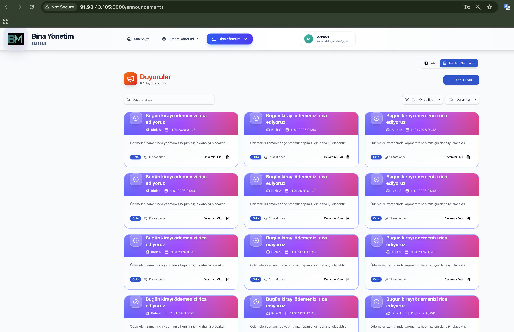

*Duyuru yönetimi timeline görünümü. Duyurular önceliklerine göre farklı boyutlarda ve renklerde görüntülenir. Acil duyurular en üstte ve büyük kartlar halinde gösterilir.*

### 8.2. Yeni Duyuru Oluşturma

**İzin Gereksinimi:** CREATE izni gerekir

Eğer CREATE izniniz varsa:
1. **"Bina Yönetimi"** menüsünden **"Duyurular"** sayfasına gidin.
2. **"Yeni Duyuru"** butonuna tıklayın (bu buton sadece CREATE izniniz varsa görünür).
3. Açılan formda:
   - **Bina:** Hangi bina için duyuru yapılacak (dropdown'dan seçilir, "Tümü" seçeneği ile tüm binalara gönderilebilir)
   - **Başlık:** Duyuru başlığı (zorunlu, örn: "Asansör Bakımı", "Aidat Ödemeleri")
   - **İçerik:** Duyuru içeriği (zorunlu, detaylı açıklama yazılabilir)
   - **Öncelik:** Düşük, Orta, Yüksek, Acil (varsayılan: Orta)
     - **Düşük:** Genel bilgilendirmeler için
     - **Orta:** Normal önemde duyurular için
     - **Yüksek:** Önemli duyurular için (renkli, dikkat çekici)
     - **Acil:** Acil durumlar için (en üstte, büyük kart)
   - **Yayın Tarihi:** Duyurunun yayınlanacağı tarih (varsayılan: bugün, gelecek tarih seçilebilir)
   - **Durum:** Aktif/Pasif (varsayılan: Aktif)
     - **Aktif:** Duyuru yayında, kullanıcılar görebilir
     - **Pasif:** Duyuru yayında değil, sadece yöneticiler görebilir
4. **"Kaydet"** butonuna tıklayın.

**Örnek Senaryolar:**

**Senaryo 1: Acil Duyuru**
- Başlık: "Su Kesintisi - Acil"
- İçerik: "Yarın saat 09:00-17:00 arası su kesintisi olacaktır."
- Öncelik: Acil
- Durum: Aktif
- Sonuç: Duyuru en üstte, büyük kırmızı kart olarak görünür

**Senaryo 2: Planlı Duyuru**
- Başlık: "Ocak Ayı Toplantısı"
- İçerik: "Ocak ayı yönetim kurulu toplantısı 15 Ocak'ta yapılacaktır."
- Öncelik: Orta
- Yayın Tarihi: 10 Ocak (gelecek tarih)
- Durum: Pasif (henüz yayınlanmamış)
- Sonuç: Duyuru oluşturulur ancak belirtilen tarihe kadar pasif kalır

Eğer CREATE izniniz yoksa:
- "Yeni Duyuru" butonu görünmez
- Yeni duyuru oluşturmaya çalışırsanız "Oluşturma yetkiniz bulunmamaktadır" hatası alırsınız

### 8.3. Duyuru Görünüm Modları

Duyurular sayfasında iki görünüm modu vardır:

- **Tablo Görünümü:** Liste halinde tüm duyurular
- **Timeline Görünümü:** Zaman çizelgesi şeklinde görsel görünüm (yukarıdaki görsel)

### 8.4. Duyuru Düzenleme ve Silme

1. Duyurular listesinde düzenlemek/silmek istediğiniz duyuruyu bulun.
2. **"Düzenle"** veya **"Sil"** ikonuna tıklayın.
3. Gerekli işlemleri tamamlayın.

---

## 9. Harcama Yönetimi

Bina yönetimine ait tüm harcamaları kaydedin ve takip edin.

### 9.1. Harcamalar Listesi

Harcamalar sayfasında tüm harcama kayıtlarını görüntüleyebilirsiniz.

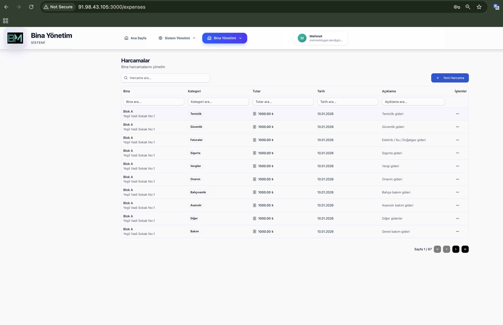

*Harcamalar listesi. Tüm harcama kayıtları detaylı olarak listelenir.*

### 9.2. Yeni Harcama Kaydı

1. **"Bina Yönetimi"** menüsünden **"Harcamalar"** sayfasına gidin.
2. **"Yeni Harcama"** butonuna tıklayın.
3. Açılan formda:
   - **Bina:** Harcamanın yapıldığı bina
   - **Kategori:** Örn: "Elektrik", "Su", "Temizlik", "Bakım"
   - **Tutar:** Harcama tutarı
   - **Tarih:** Harcama tarihi
   - **Açıklama:** Harcama detayları
   - **Fatura No:** Fatura numarası (opsiyonel)
   - **Ödeme Yöntemi:** Örn: "Nakit", "Banka Havalesi"
4. **"Kaydet"** butonuna tıklayın.

### 9.3. Harcama Kategorileri

Harcamaları kategorilere ayırarak daha düzenli takip edebilirsiniz:

- **Elektrik:** Elektrik faturaları
- **Su:** Su faturaları
- **Doğalgaz:** Doğalgaz faturaları
- **Temizlik:** Temizlik malzemeleri ve hizmetleri
- **Bakım:** Bakım ve onarım giderleri
- **Güvenlik:** Güvenlik hizmetleri
- **Personel:** Personel maaşları
- **Diğer:** Diğer harcamalar

### 9.4. Harcama Raporları

1. **"Harcamalar"** sayfasında **"Raporlar"** sekmesine gidin.
2. Şu raporları görüntüleyebilirsiniz:
   - **Aylık Harcamalar:** Aylık toplam harcamalar
   - **Kategori Bazlı:** Kategorilere göre harcama dağılımı
   - **Bina Bazlı:** Binalara göre harcama dağılımı
   - **Grafik Görünümü:** Görsel grafiklerle harcama analizi

---

## 10. Toplantı Yönetimi

Yönetim kurulu toplantılarını kaydedin ve yönetin.

### 10.1. Toplantılar Kart Görünümü

Toplantılar sayfasında kart görünümü ile toplantıları görsel olarak görüntüleyebilirsiniz.

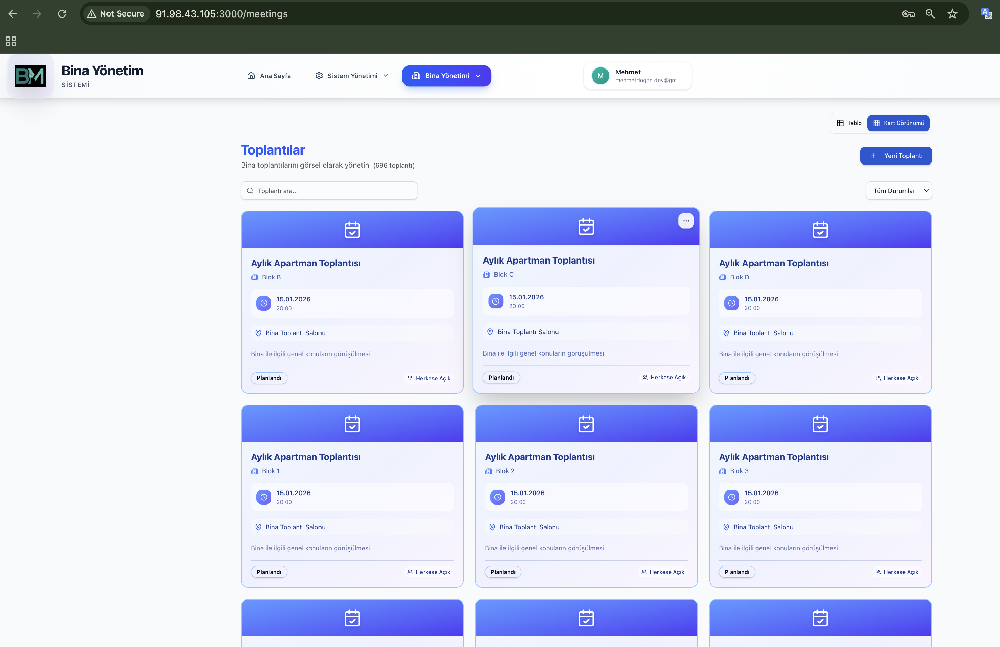

*Toplantılar kart görünümü. Toplantılar görsel kartlar halinde görüntülenir.*

### 10.2. Toplantı Detayları

Toplantı detay sayfasında toplantı hakkında tüm bilgileri ve alınan kararları görüntüleyebilirsiniz.

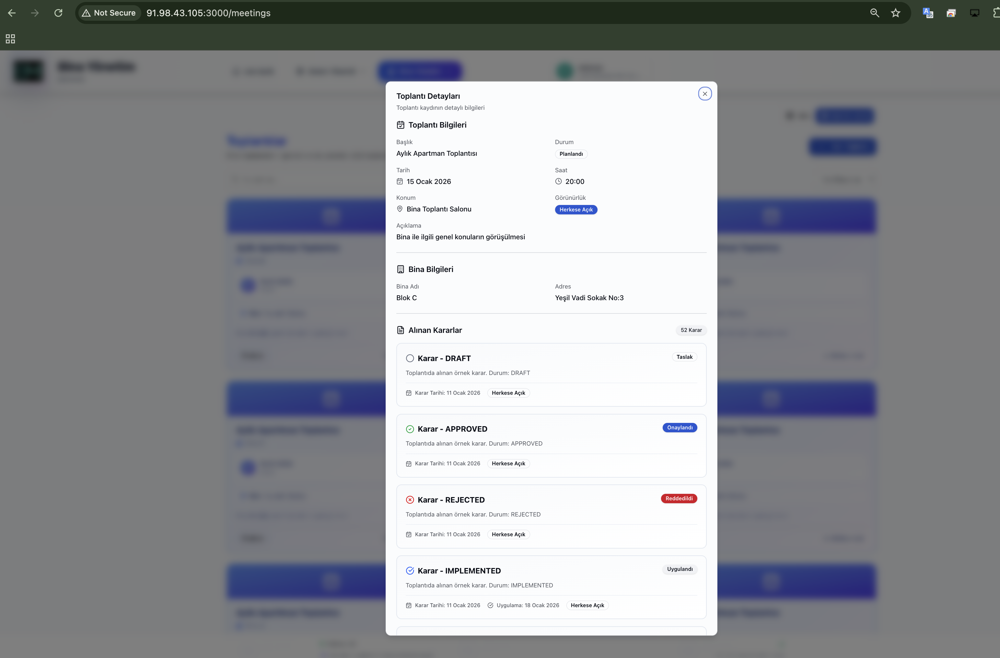

*Toplantı detay sayfası. Toplantı bilgileri, tutanak ve alınan kararlar görüntülenir.*

### 10.3. Yeni Toplantı Oluşturma

1. **"Bina Yönetimi"** menüsünden **"Toplantılar"** sayfasına gidin.
2. **"Yeni Toplantı"** butonuna tıklayın.
3. Açılan formda:
   - **Bina:** Toplantının yapılacağı bina
   - **Toplantı Başlığı:** Toplantı konusu
   - **Açıklama:** Toplantı içeriği
   - **Tarih:** Toplantı tarihi
   - **Saat:** Toplantı saati
   - **Konum:** Toplantı yeri
   - **Durum:** Planlandı, Devam Ediyor, Tamamlandı, İptal Edildi
   - **Herkese Açık mı?:** Toplantının herkese açık olup olmadığı
4. **"Kaydet"** butonuna tıklayın.

### 10.4. Toplantı Tutanağı Ekleme

1. Toplantı detay sayfasında **"Tutanağı Düzenle"** butonuna tıklayın.
2. Toplantı tutanağını yazın.
3. **"Kaydet"** butonuna tıklayın.

### 10.5. Toplantı Durumunu Güncelleme

1. Toplantı listesinde durumunu güncellemek istediğiniz toplantıyı bulun.
2. **"Düzenle"** ikonuna tıklayın.
3. **Durum** alanını güncelleyin.
4. **"Kaydet"** butonuna tıklayın.

### 10.6. Toplantı Görünüm Modları

- **Tablo Görünümü:** Liste halinde tüm toplantılar
- **Kart Görünümü:** Görsel kartlar halinde toplantılar (yukarıdaki görsel)

---

## 11. Karar Yönetimi

Toplantılarda alınan kararları kaydedin ve takip edin.

### 11.1. Karar Listesi

Kararlar sayfasında tüm karar kayıtlarını görüntüleyebilirsiniz.

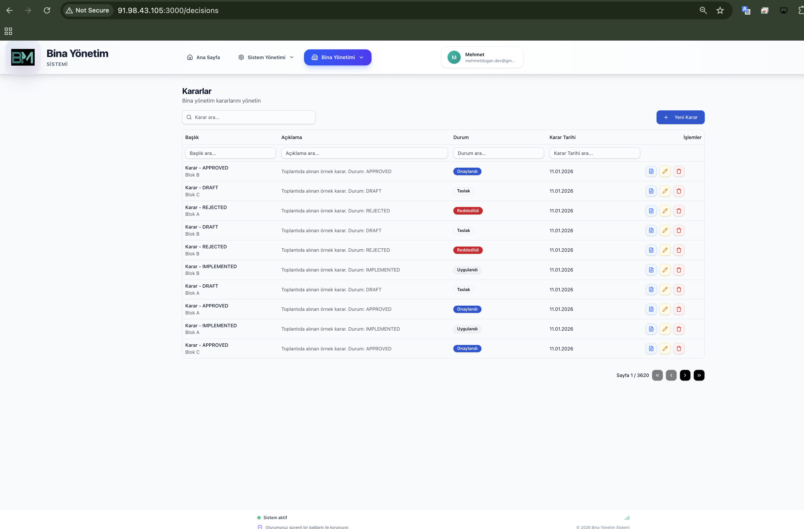

*Karar listesi. Tüm karar kayıtları listelenir ve yönetilebilir.*

### 11.2. Yeni Karar Kaydı

1. **"Bina Yönetimi"** menüsünden **"Kararlar"** sayfasına gidin.
2. **"Yeni Karar"** butonuna tıklayın.
3. Açılan formda:
   - **Toplantı:** Hangi toplantıda alındı (opsiyonel)
   - **Karar Başlığı:** Karar konusu
   - **Açıklama:** Karar detayları
   - **Karar Tarihi:** Kararın alındığı tarih
   - **Uygulama Tarihi:** Kararın uygulanacağı tarih
   - **Durum:** Beklemede, Uygulanıyor, Tamamlandı, İptal Edildi
   - **Herkese Açık mı?:** Kararın herkese açık olup olmadığı
4. **"Kaydet"** butonuna tıklayın.

### 11.3. Karar Durumunu Güncelleme

1. Kararlar listesinde durumunu güncellemek istediğiniz kararı bulun.
2. **"Düzenle"** ikonuna tıklayın.
3. **Durum** alanını güncelleyin.
4. **"Kaydet"** butonuna tıklayın.

---

## 12. Şikayet Yönetimi

Bina sakinlerinden gelen şikayetleri kaydedin ve takip edin.

### 12.1. Şikayet Listesi

Şikayetler sayfasında tüm şikayet kayıtlarını görüntüleyebilirsiniz. (Görsel mevcut değil, genel liste görünümü benzer)

### 12.2. Yeni Şikayet Kaydı

1. **"Bina Yönetimi"** menüsünden **"Şikayetler"** sayfasına gidin.
2. **"Yeni Şikayet"** butonuna tıklayın.
3. Açılan formda:
   - **Daire:** Şikayeti yapan daire
   - **Şikayet Başlığı:** Şikayet konusu
   - **Açıklama:** Şikayet detayları
   - **Kategori:** Örn: "Gürültü", "Temizlik", "Güvenlik", "Bakım"
   - **Öncelik:** Düşük, Orta, Yüksek, Acil
   - **Durum:** Yeni, İnceleniyor, Çözüldü, İptal Edildi
4. **"Kaydet"** butonuna tıklayın.

### 12.3. Şikayet Durumunu Güncelleme

1. Şikayetler listesinde durumunu güncellemek istediğiniz şikayeti bulun.
2. **"Düzenle"** ikonuna tıklayın.
3. **Durum** ve **Çözüm Notları** alanlarını güncelleyin.
4. **"Kaydet"** butonuna tıklayın.

---

## 13. Bakım ve Tadilat

Bakım ve tadilat işlemlerini kaydedin ve takip edin.

### 13.1. Bakım Listesi

Bakım/Tadilat sayfasında tüm bakım kayıtlarını görüntüleyebilirsiniz.

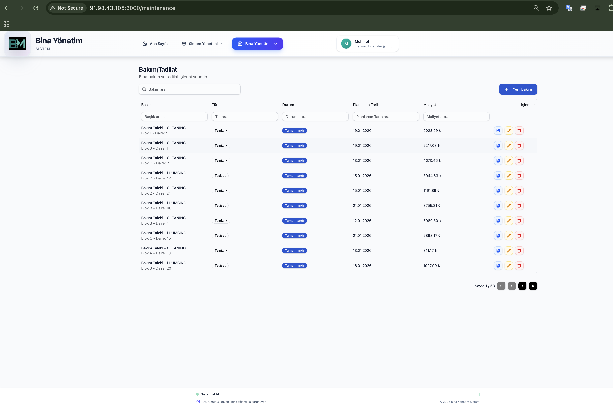

*Bakım listesi. Tüm bakım ve tadilat kayıtları listelenir ve yönetilebilir.*

### 13.2. Yeni Bakım/Tadilat Kaydı

1. **"Bina Yönetimi"** menüsünden **"Bakım/Tadilat"** sayfasına gidin.
2. **"Yeni Kayıt"** butonuna tıklayın.
3. Açılan formda:
   - **Bina:** Bakım/tadilat yapılacak bina
   - **Başlık:** İş başlığı
   - **Açıklama:** İş detayları
   - **Kategori:** Örn: "Elektrik", "Su", "Asansör", "Çatı"
   - **Öncelik:** Düşük, Orta, Yüksek, Acil
   - **Başlangıç Tarihi:** İşin başlangıç tarihi
   - **Bitiş Tarihi:** İşin bitiş tarihi (tahmini)
   - **Durum:** Planlandı, Devam Ediyor, Tamamlandı, İptal Edildi
   - **Maliyet:** İş maliyeti (opsiyonel)
4. **"Kaydet"** butonuna tıklayın.

### 13.3. Bakım Durumunu Güncelleme

1. Bakım listesinde durumunu güncellemek istediğiniz kaydı bulun.
2. **"Düzenle"** ikonuna tıklayın.
3. **Durum** ve **Notlar** alanlarını güncelleyin.
4. **"Kaydet"** butonuna tıklayın.

---

## 14. Ziyaretçi Yönetimi

Bina ziyaretçilerini kaydedin ve takip edin.

### 14.1. Ziyaretçiler Listesi

Ziyaretçiler sayfasında tüm ziyaretçi kayıtlarını görüntüleyebilirsiniz.

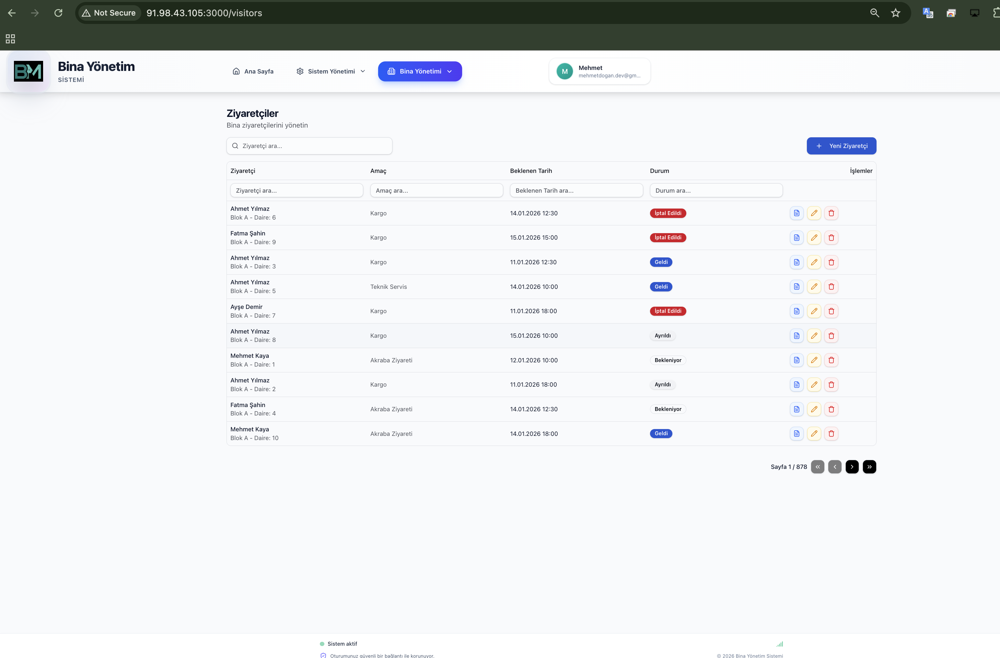

*Ziyaretçiler listesi. Tüm ziyaretçi kayıtları listelenir ve yönetilebilir.*

### 14.2. Yeni Ziyaretçi Kaydı

1. **"Bina Yönetimi"** menüsünden **"Ziyaretçiler"** sayfasına gidin.
2. **"Yeni Ziyaretçi"** butonuna tıklayın.
3. Açılan formda:
   - **Ad Soyad:** Ziyaretçinin adı
   - **TC Kimlik No:** TC kimlik numarası (opsiyonel)
   - **Telefon:** İletişim telefonu
   - **Ziyaret Edilecek Daire:** Hangi daireyi ziyaret edecek
   - **Giriş Tarihi:** Giriş tarihi
   - **Giriş Saati:** Giriş saati
   - **Çıkış Tarihi:** Çıkış tarihi (opsiyonel)
   - **Çıkış Saati:** Çıkış saati (opsiyonel)
   - **Araç Plakası:** Araç varsa plaka (opsiyonel)
4. **"Kaydet"** butonuna tıklayın.

### 14.3. Ziyaretçi Çıkış Kaydı

1. Ziyaretçiler listesinde çıkış yapacak ziyaretçiyi bulun.
2. **"Çıkış Yap"** butonuna tıklayın.
3. Çıkış tarihi ve saati otomatik olarak kaydedilir.

---

## 15. Araç Yönetimi

Bina sakinlerine ait araçları kaydedin ve yönetin.

### 15.1. Araçlar Listesi

Araçlar sayfasında tüm araç kayıtlarını görüntüleyebilirsiniz.

*Araçlar listesi. Tüm araç kayıtları listelenir ve yönetilebilir.*

### 15.2. Yeni Araç Kaydı

1. **"Bina Yönetimi"** menüsünden **"Araçlar"** sayfasına gidin.
2. **"Yeni Araç"** butonuna tıklayın.
3. Açılan formda:
   - **Daire:** Aracın sahibi olan daire
   - **Plaka:** Araç plakası
   - **Marka:** Araç markası
   - **Model:** Araç modeli
   - **Renk:** Araç rengi
   - **Araç Tipi:** Örn: "Otomobil", "Motosiklet", "Kamyonet"
   - **Açıklama:** Ek bilgiler (opsiyonel)
4. **"Kaydet"** butonuna tıklayın.

### 15.3. Araç Bilgilerini Güncelleme

1. Araçlar listesinde güncellemek istediğiniz aracı bulun.
2. **"Düzenle"** ikonuna tıklayın.
3. Bilgileri güncelleyin.
4. **"Kaydet"** butonuna tıklayın.

---

## 16. Otopark Yönetimi

Otopark alanlarını ve park yerlerini yönetin.

### 16.1. Otopark 2D Görünümü

Otopark sayfasında otopark alanlarını 2D görünümde görüntüleyebilirsiniz.

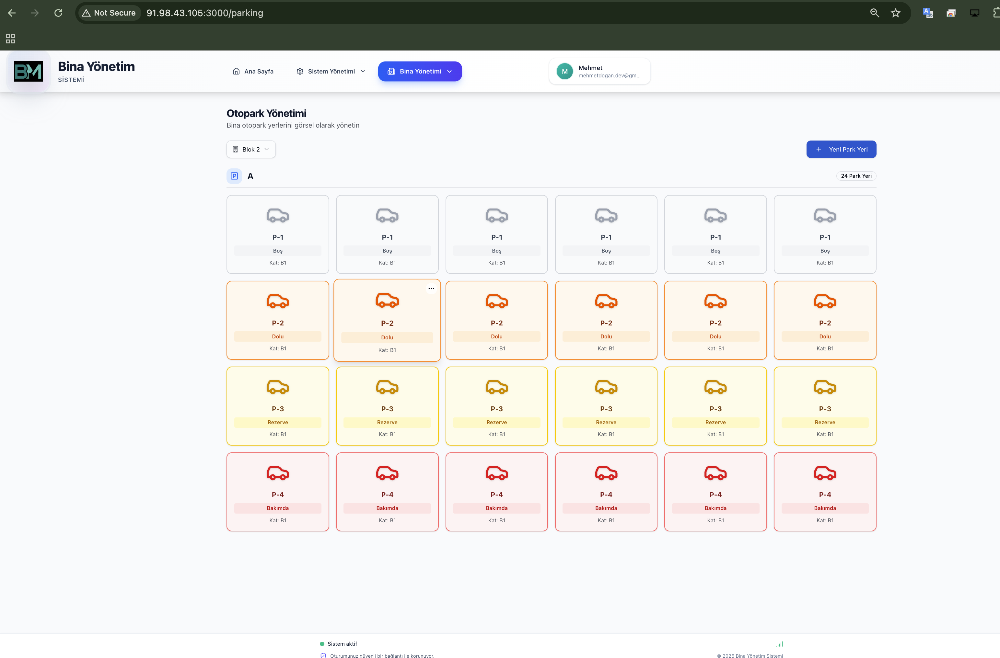

*Otopark 2D görünümü. Otopark alanları ve park yerleri görsel olarak görüntülenir.*

### 16.2. Otopark Alanı Oluşturma

1. **"Bina Yönetimi"** menüsünden **"Otopark"** sayfasına gidin.
2. **"Yeni Otopark"** butonuna tıklayın.
3. Açılan formda:
   - **Bina:** Otoparkın hangi binaya ait olduğu
   - **Otopark Adı:** Örn: "Zemin Kat Otopark", "Bodrum Kat Otopark"
   - **Toplam Park Yeri:** Toplam park yeri sayısı
   - **Açıklama:** Ek bilgiler
4. **"Kaydet"** butonuna tıklayın.

### 16.3. Park Yeri Atama

1. Otopark detay sayfasında **"Park Yeri Atama"** sekmesine gidin.
2. **"Yeni Atama"** butonuna tıklayın.
3. **Araç** ve **Park Yeri Numarası** seçin.
4. **"Kaydet"** butonuna tıklayın.

---

## 17. Stok ve Envanter Yönetimi

Bina yönetiminde kullanılan malzemelerin stok takibini yapın.

### 17.1. Stok Takibi Görünümü

Stok takibi sayfasında stok durumunu görsel olarak görüntüleyebilirsiniz.

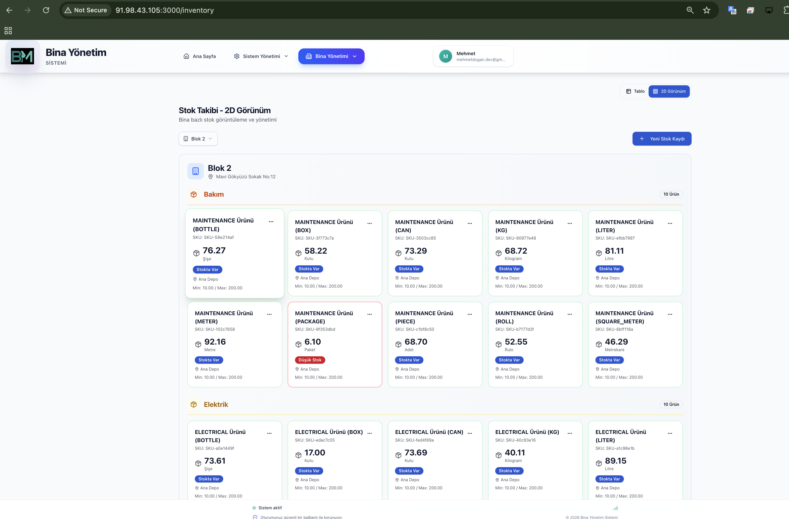

*Stok takibi görünümü. Stok durumu görsel olarak görüntülenir.*

### 17.2. Stok Takibi Tablo Görünümü

Stok takibi sayfasında tablo görünümü ile detaylı stok bilgilerini görüntüleyebilirsiniz.

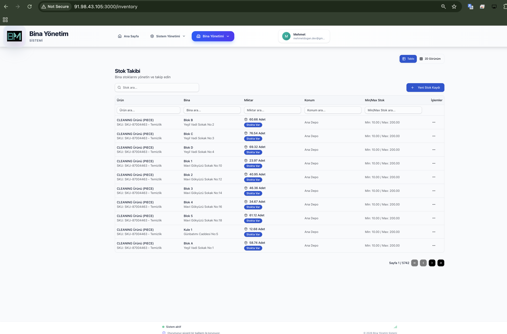

*Stok takibi tablo görünümü. Tüm stok kayıtları detaylı olarak listelenir.*

### 17.3. Ürün Kaydı

Ürünler sayfasında tüm ürünleri görüntüleyebilirsiniz.

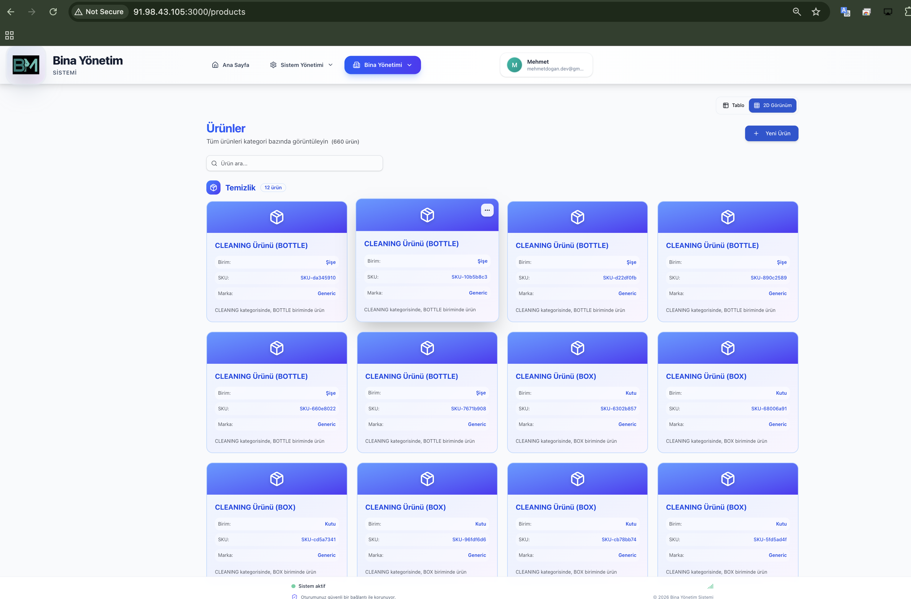

*Ürünler listesi. Tüm ürünler görsel kartlar halinde görüntülenir.*

### 17.4. Ürünler Tablo Görünümü

Ürünler sayfasında tablo görünümü ile detaylı ürün bilgilerini görüntüleyebilirsiniz.

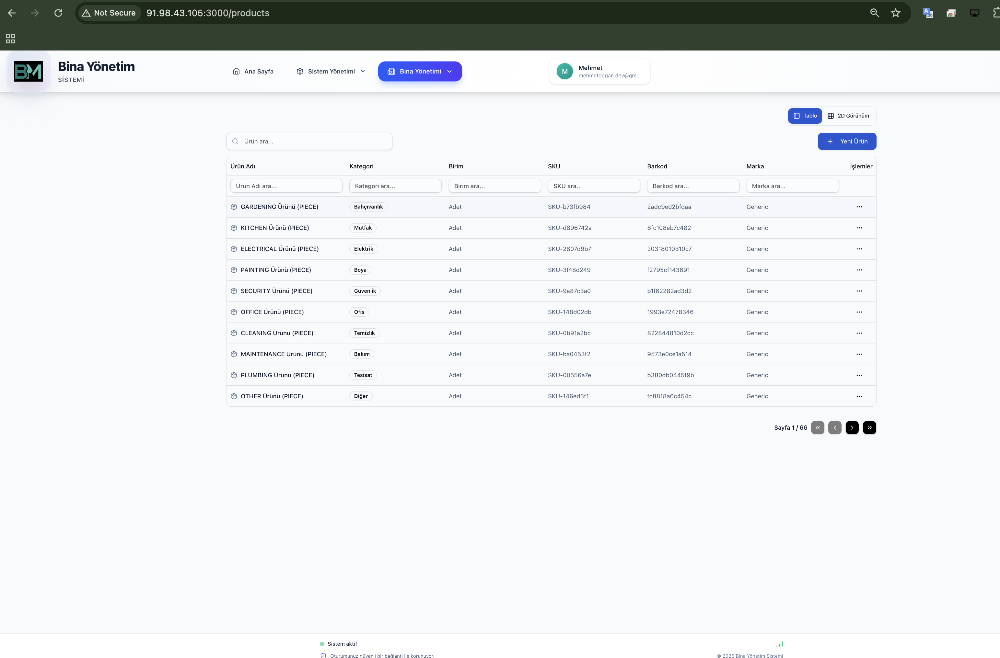

*Ürünler tablo görünümü. Tüm ürünler detaylı olarak listelenir.*

### 17.5. Yeni Ürün Ekleme

1. **"Bina Yönetimi"** menüsünden **"Ürünler"** sayfasına gidin.
2. **"Yeni Ürün"** butonuna tıklayın.
3. Açılan formda:
   - **Ürün Adı:** Ürün adı
   - **Kategori:** Örn: "Temizlik", "Elektrik", "Su", "Bahçe"
   - **Birim:** Örn: "Adet", "Kg", "Litre", "Metre"
   - **Açıklama:** Ürün açıklaması
4. **"Kaydet"** butonuna tıklayın.

### 17.6. Stok Girişi

1. **"Stok Takibi"** sayfasına gidin.
2. **"Yeni Stok Girişi"** butonuna tıklayın.
3. Açılan formda:
   - **Ürün:** Hangi ürün için stok girişi yapılacak
   - **Bina:** Hangi binaya stok girişi yapılacak
   - **Miktar:** Giriş miktarı
   - **Tarih:** Stok giriş tarihi
   - **Açıklama:** Ek bilgiler
4. **"Kaydet"** butonuna tıklayın.

### 17.7. Stok Çıkışı

1. **"Stok Takibi"** sayfasında **"Stok Çıkışı"** butonuna tıklayın.
2. **Ürün**, **Bina**, **Miktar** ve **Tarih** bilgilerini girin.
3. **"Kaydet"** butonuna tıklayın.

### 17.8. Stok Durumu

1. **"Stok Takibi"** sayfasında stok durumunu görüntüleyebilirsiniz.
2. Her ürün için:
   - **Mevcut Stok:** Mevcut stok miktarı
   - **Minimum Stok:** Minimum stok seviyesi
   - **Maksimum Stok:** Maksimum stok seviyesi
   - **Durum:** Yeterli, Düşük, Tükendi

---

## 18. Profil ve Ayarlar

### 18.1. Kullanıcı Bilgileri Sayfası

Kullanıcı bilgileri sayfasında profil bilgilerinizi görüntüleyebilir ve güncelleyebilirsiniz.

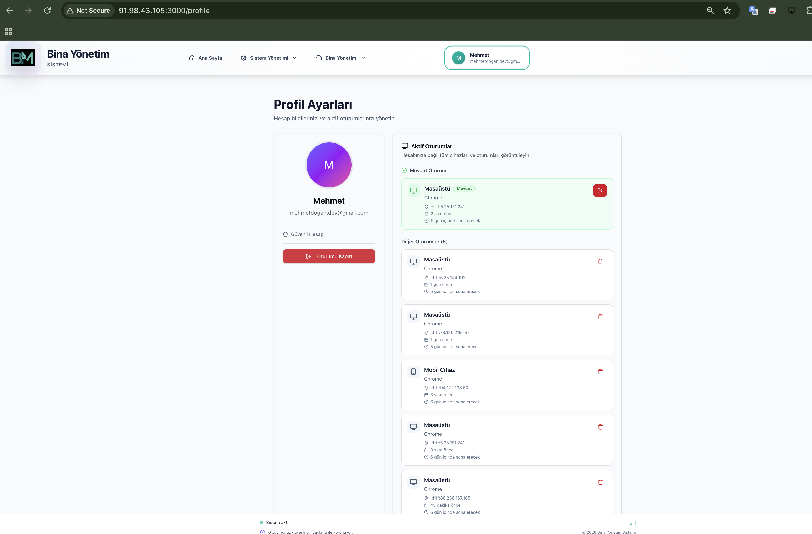

*Kullanıcı bilgileri sayfası. Profil bilgileri, şifre değiştirme ve diğer ayarlar görüntülenir.*

### 18.2. Profil Bilgilerini Güncelleme

1. Sağ üst köşedeki profil menüsüne tıklayın.
2. **"Profil"** seçeneğini seçin.
3. Profil bilgilerinizi güncelleyin:
   - Ad Soyad
   - Telefon
   - E-posta
   - Profil Fotoğrafı
4. **"Kaydet"** butonuna tıklayın.

### 18.3. Şifre Değiştirme

1. Profil sayfasında **"Şifre Değiştir"** bölümüne gidin.
2. Mevcut şifrenizi girin.
3. Yeni şifrenizi girin.
4. Yeni şifrenizi tekrar girin.
5. **"Kaydet"** butonuna tıklayın.

---

## 19. Sık Sorulan Sorular

### 19.1. Genel Sorular

**S: Sistemde birden fazla bina grubu yönetebilir miyim?**  
C: Evet, sistemde sınırsız sayıda bina grubu oluşturabilirsiniz.

**S: Dairelere birden fazla kullanıcı atayabilir miyim?**  
C: Evet, bir daireye birden fazla kullanıcı (örnek: eş, çocuklar) atayabilirsiniz.

**S: Aidat ödemelerini nasıl takip edebilirim?**  
C: Aidat Yönetimi sayfasında ödenen, bekleyen ve geciken aidatları görüntüleyebilirsiniz.

**S: Toplantı tutanaklarını sisteme kaydedebilir miyim?**  
C: Evet, Toplantılar sayfasında toplantı tutanaklarını kaydedebilir ve düzenleyebilirsiniz.

**S: Sistemde rapor alabilir miyim?**  
C: Evet, birçok modülde rapor görüntüleme ve dışa aktarma özelliği bulunmaktadır.

### 19.2. Teknik Sorular

**S: Sistem mobil cihazlardan kullanılabilir mi?**  
C: Evet, sistem web tabanlıdır ve tüm mobil cihazlardan erişilebilir.

**S: Verilerim güvende mi?**  
C: Evet, sistem güvenli veri tabanı ve şifreleme teknolojileri kullanmaktadır.

**S: Yedekleme yapılıyor mu?**  
C: Evet, sistem düzenli olarak otomatik yedekleme yapmaktadır.

---

## 20. İletişim ve Destek

### 20.1. Destek Talebi Oluşturma

Sistemle ilgili sorularınız veya sorunlarınız için:

1. Sistem yöneticinizle iletişime geçin.
2. **"Mesajlar"** modülü üzerinden destek talebi oluşturabilirsiniz.

### 20.2. Kullanım Kılavuzu Güncellemeleri

Bu kılavuz, sistem güncellemelerine göre düzenli olarak güncellenmektedir. En güncel versiyonu sistem yöneticinizden temin edebilirsiniz.

---

## 📝 Ekler

### Ek A: Kısayol Tuşları

- **Ctrl + K:** Hızlı arama
- **Esc:** Açık pencereleri kapat
- **Tab:** Form alanları arasında gezinme

### Ek B: Terimler Sözlüğü

- **Bina Grubu:** Birden fazla binayı bir araya getiren üst yapı (Site, Rezidans)
- **Aidat:** Daire başına düzenli olarak alınan yönetim ücreti
- **Tutanağı:** Toplantıda konuşulanların yazılı kaydı
- **Stok:** Mevcut malzeme miktarı

---

**Kılavuz Sonu**

Bu kılavuz, Bina Yönetim Sistemi'nin temel kullanımını kapsamaktadır. Daha detaylı bilgi için sistem yöneticinizle iletişime geçebilirsiniz.

---

*Son Güncelleme: 2025*
